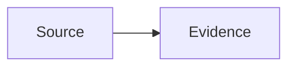

# Contributing

## Development prerequisites

ClauseSift uses `pre-commit` to run the same documentation checks locally and in
GitHub Actions.

Required tools:

- Python 3.13 or a compatible supported Python version;
- Git;
- Node.js 22 or later, including `npx`;
- `pre-commit` 4.6.0 or later.

The Mermaid hook uses the official Mermaid CLI. The checker invokes the pinned
`@mermaid-js/mermaid-cli` version through `npx` when `mmdc` is not already
installed. The first Mermaid check may therefore download the CLI and its
browser dependency; subsequent checks normally use the local npm cache.

## Install the hooks

```bash
python -m pip install pre-commit==4.6.0
pre-commit install
```

Run every configured check against the repository:

```bash
pre-commit run --all-files
```

## Documentation checks

Markdown files are checked with `markdownlint-cli2`.

Mermaid diagrams must use fenced Markdown blocks:

````markdown

````

The custom `scripts/check_mermaid.py` checker extracts each Mermaid block and
renders it with the official Mermaid CLI. A commit fails when a block is empty,
its fence is unclosed, Mermaid cannot parse it, or Mermaid cannot render it.

To run the Mermaid check directly:

```bash
python scripts/check_mermaid.py docs/design.md
```

Set `MERMAID_CLI` to use a specific installed executable instead of `mmdc` or
the `npx` fallback:

```bash
MERMAID_CLI=/path/to/mmdc python scripts/check_mermaid.py docs/design.md
```

## Continuous integration

The `Documentation quality` workflow runs all pre-commit hooks for Markdown,
Mermaid, and repository file hygiene on relevant pushes and pull requests.
Local and CI checks intentionally share `.pre-commit-config.yaml` so they do
not drift into separate validation rules.
