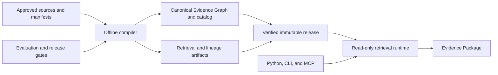
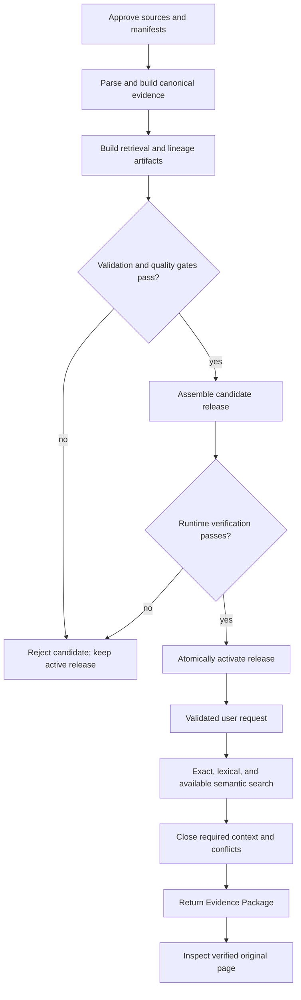

# ClauseSift Design Brief

- **Document version:** 0.2
- **Status:** Product-intent baseline
- **Detailed realization:** [ClauseSift Design Document](design.md)
- **Design rules:** [ClauseSift Design Principles](design-principles.md)

## 1. Role

This brief defines ClauseSift's product intent: its purpose, users, boundaries,
major components, major workflow, and first usable release. It deliberately does
not define schemas, algorithms, protocols, thresholds, failure routing, or test
matrices; those belong in the detailed design.

The three documents have distinct authority:

- this brief owns product intent;
- the design principles own durable decision rules;
- the detailed design owns the technical realization of both.

They must remain consistent. A change to product intent starts here; a change to
a design rule starts in the principles; all resulting technical changes are made
in the detailed design.

## 2. Product intent

ClauseSift is an accuracy-first, local evidence-retrieval engine for engineering
standards, codes, design guidelines, technical manuals, and product
specifications.

It compiles a lawfully held document corpus into a verified, immutable knowledge
base and returns an **Evidence Package**: source-backed text, identity and edition,
applicability context, citations, conflicts, warnings, and a path to the original
page.

ClauseSift retrieves and organizes evidence. It does not approve designs, make
engineering or legal decisions, or replace professional judgment.

## 3. Users and boundaries

The initial user is a single technical practitioner working with HVAC,
ventilation, smoke-control, fire-safety, and manufacturer documentation. The
user may work through Python, a command-line interface, or an MCP-compatible AI
client.

The initial product assumes a local, relatively small, slowly changing corpus
that may include born-digital PDFs, scans, complex tables, and multiple editions.
The user supplies the documents and reviewed metadata and remains responsible
for lawful access and professional interpretation.

In scope:

- exact clause and document lookup;
- lexical retrieval with metadata filters;
- optional semantic retrieval and reranking when validated;
- deterministic inclusion of required context and material conflicts;
- original-page inspection and complete evidence lineage;
- offline rebuilding, validation, activation, and rollback.

Out of scope:

- general-purpose chat or agent orchestration;
- multi-user collaboration or enterprise document management;
- online document synchronization;
- engineering calculations, autonomous approval, or legal determination;
- redistribution of copyrighted source documents.

## 4. Major components

| Component | Responsibility |
| --- | --- |
| Sources and manifests | Preserve approved document bytes and reviewed identity, edition, status, and applicability metadata. |
| Offline compiler | Parse, normalize, relate, evaluate, and package the corpus. |
| Evidence Graph and catalog | Hold the canonical structure, identities, provenance, and reviewed relationships. |
| Retrieval and lineage artifacts | Accelerate search and explain how evidence was produced. |
| Immutable release | Bind verified catalog and artifacts into one reproducible serving unit. |
| Read-only runtime | Search one active release, close required context, and assemble results without mutation. |
| Interfaces and Evidence Package | Expose one evidence contract through Python, CLI, and MCP. |
| Evaluation and release gates | Prevent unverified parser, retrieval, context, or release changes from activation. |

## 5. Major workflow

Build work occurs offline. A failed or partial candidate never replaces the
active release. Successful candidates are verified before atomic activation,
and an earlier valid release remains available for recovery.

At query time, the runtime validates the request, retrieves evidence through the
available channels, adds all required interpretive context and material conflict
sides, and returns one Evidence Package. Faster retrieval modes may change how
candidates are found, but not the evidence meaning or required context.

## 6. First usable release

The first usable release completes the dependable exact-and-lexical path before
semantic retrieval is required. It must:

- install as a Python package and initialize a local workspace;
- ingest selected PDFs through approved manifests and verified source hashes;
- preserve document, edition, clause, page, classification, and source identity;
- build and verify an immutable release with evidence lineage;
- support exact clause lookup and lexical search with metadata filters;
- attach required context and every material conflict side under bounded rules;
- return original evidence, deterministic citations, and explicit insufficiency
  or typed failure when safe evidence cannot be returned;
- expose consistent retrieval behavior through Python, CLI, and MCP;
- support candidate validation, atomic activation, and rollback.

Semantic retrieval, reranking, broader document families, and version or product
intelligence follow only after this baseline is reliable.

## 7. Success

ClauseSift succeeds when a practitioner can retrieve evidence faster while
retaining the source fidelity, context, uncertainty, and traceability needed for
professional review.

Release acceptance is defined quantitatively in the detailed design. At the
product level, success means:

- answerable requests return the correct source-backed evidence and context;
- insufficient or unsafe requests fail visibly rather than producing plausible
  unsupported material;
- editions, evidence roles, and conflicts are never silently collapsed;
- released knowledge bases are reproducible, verifiable, and recoverable;
- Python, CLI, and MCP present the same evidence semantics.

The detailed design is the authoritative source for implementation contracts,
evaluation methods, and acceptance thresholds.
