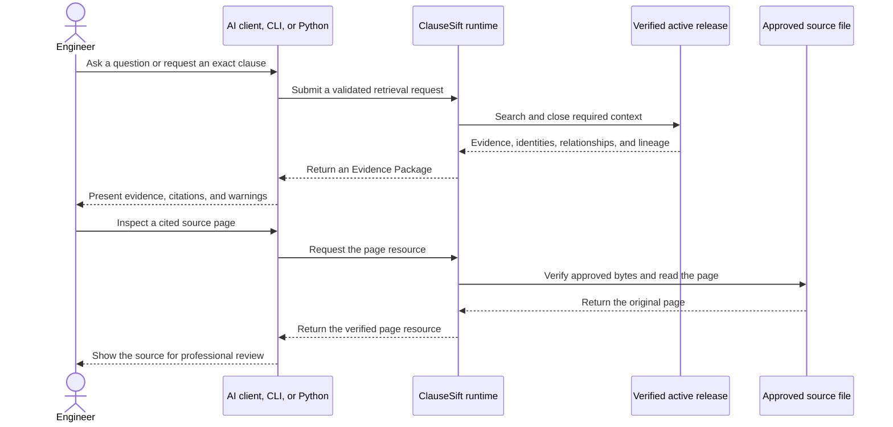
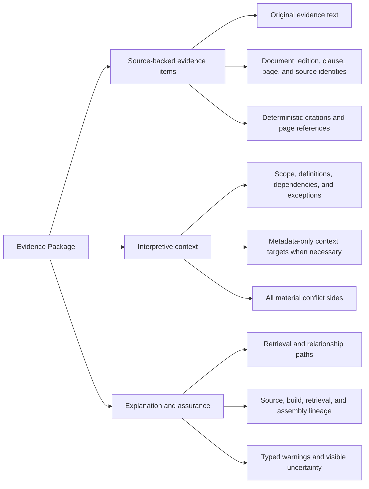
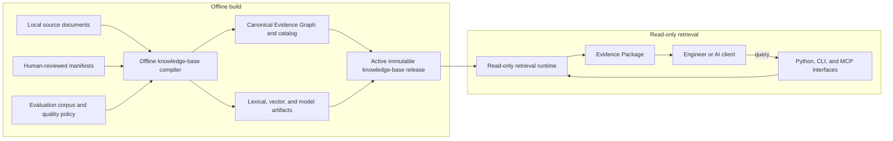
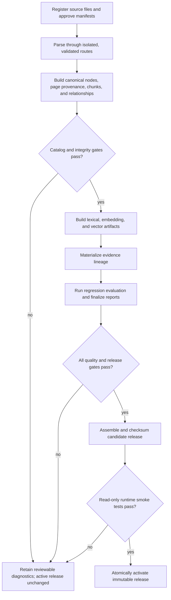
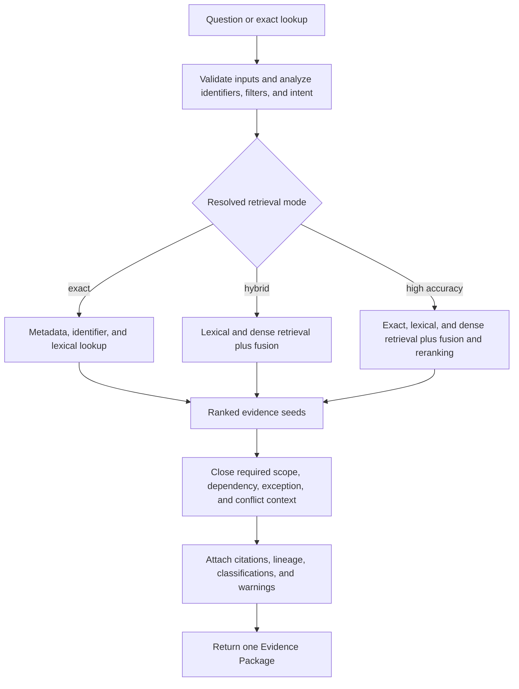
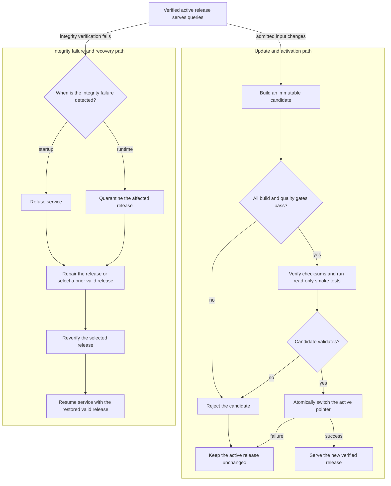

# ClauseSift Design Brief

- **Document version:** 0.1
- **Status:** Product-intent baseline
- **Project:** ClauseSift
- **Companion rules:** [ClauseSift Design Principles](design-principles.md)
- **Detailed realization:** [ClauseSift Design Document](design.md)

## 1. Purpose

This brief defines what ClauseSift is intended to achieve, for whom, and through
which major product capabilities and workflows. It is the upstream source for
product scope and architectural intent. The companion design principles define
the rules for translating that intent into technical contracts, schemas,
interfaces, gates, and implementation decisions in the detailed design.

This brief was reconstructed after the initial detailed design. Going forward:

- change this brief first when the product target, scope, major components, or
  major workflow changes;
- change the detailed design directly when elaborating implementation details
  within the approved brief;
- update both documents when a technical decision changes product behavior or a
  product decision changes a technical contract;
- resolve inconsistencies explicitly rather than silently treating either
  document as universally authoritative outside its stated level.

## 2. Product statement

ClauseSift is an accuracy-first, local evidence-retrieval engine for engineering
standards, codes, design guidelines, technical manuals, and product
specifications.

It turns a lawfully held document corpus into an immutable, searchable knowledge
base and returns defensible evidence packages containing the correct source,
edition, clause, applicability context, original text, citation, and path back to
the original page.

ClauseSift retrieves and organizes evidence. It does not make engineering or
legal decisions, approve designs, or replace professional judgment.

## 3. Problem to solve

Engineering questions rarely depend on one isolated sentence. Correct use of a
requirement may depend on its document edition, parent scope, definitions,
exceptions, notes, table headers and units, referenced clauses, amendments, and
jurisdictional context.

Generic retrieval-augmented generation systems often flatten this structure,
mix editions, omit limiting context, or return fluent prose without a reliable
path to the source. They also commonly introduce multi-user and online service
infrastructure that is unnecessary for an individual engineer working with a
stable local corpus.

ClauseSift must make repeated evidence lookup faster without weakening source
fidelity, contextual completeness, or auditability.

## 4. Target users and operating context

### 4.1 Primary user

The initial user is a single technical practitioner working with HVAC,
ventilation, smoke-control, fire-safety, and manufacturer documentation.

The user needs to:

- find a known document, edition, clause, model, value, or table precisely;
- discover relevant provisions from a natural-language engineering question;
- see the scope, definitions, exceptions, notes, dependencies, and conflicts
  required to interpret a result;
- inspect the original page behind every source-backed item;
- compare editions or related sources without silently combining them;
- use the same evidence service from an AI client, terminal, or Python program.

### 4.2 Initial operating assumptions

- The corpus is local, relatively small, and changes infrequently.
- Documents may include born-digital PDFs, scans, complex tables, and multiple
  editions.
- The user supplies documents and human-reviewed metadata and is responsible for
  lawful access and use.
- Expensive processing can occur offline; interactive retrieval should remain
  lightweight and read-only.
- Local execution is the default. Sending document or query content to an
  external provider requires explicit configuration.

## 5. Desired product outcome

The defining output is an **Evidence Package**, not a generated answer.

For an answerable query, the package should provide:

- original source-backed evidence text;
- stable document, edition, clause, page, and source identities;
- deterministic citations and page references;
- the required context for correct interpretation;
- visible document status, evidence classification, and applicability metadata;
- the retrieval and relationship paths that explain why each item was included;
- typed warnings for ambiguity, incomplete coordinates, unresolved references,
  unavailable capabilities, or conflicts.

For an unanswerable or unsafe query, ClauseSift should return explicit
insufficiency or a typed failure rather than plausible unsupported evidence.

## 6. Goals

ClauseSift should:

1. Ingest local engineering documents without redistributing their content.
2. Preserve source identity, edition, lifecycle status, structure, page mapping,
   and source hashes.
3. Represent clauses, requirements, exceptions, notes, definitions, tables, and
   cross-document relationships without collapsing their distinct meanings.
4. Support exact, lexical, semantic, and high-accuracy retrieval paths through a
   stable evidence model.
5. Attach all required interpretive context to retrieved evidence.
6. Preserve conflicts and uncertainty without inventing a winner.
7. Produce immutable, reproducible, verifiable knowledge-base releases.
8. Keep the query runtime local, read-only, and operationally simple.
9. Expose one shared retrieval capability through Python, CLI, and MCP.
10. Measure parser, retrieval, context, citation, and end-to-end quality against a
    project-specific evaluation corpus.
11. Allow parsers, models, and index engines to change without changing the
    public evidence contract.

## 7. Non-goals

The initial product is not:

- a general-purpose chat application;
- a multi-user document-management or collaboration platform;
- an online document-sync or enterprise connector service;
- a generic agent-orchestration system;
- an engineering calculation engine;
- an autonomous design-approval or legal-enforceability system;
- a universal or probabilistically generated knowledge graph;
- a distributor of copyrighted standards, specifications, or user corpora.

## 8. Product priorities and principles

When requirements compete, use this priority order:

1. Accuracy.
2. Query speed.
3. Traceability and reproducibility.
4. Operational simplicity.
5. Build speed.

The following principles constrain every detailed design:

- **Original sources remain authoritative.** Structured data and generated
  metadata may improve retrieval but cannot replace source text or pages.
- **Compile offline; serve read-only.** Perform document-dependent work once and
  publish it as an immutable release.
- **Prefer deterministic evidence.** Human-reviewed manifests, parsers, schemas,
  and rules own identity and source facts; models do not invent authority.
- **Keep evidence dimensions separate.** Document genre, lifecycle status,
  normative role, source modality, jurisdiction, applicability, and graph
  relationships must not be collapsed into one label.
- **Preserve context and disagreement.** A fast result is unacceptable when it
  omits a required condition, exception, table context, or material conflict.
- **Fail visibly and safely.** Invalid sources, uncertain parsing, unresolved
  relationships, corrupt releases, and unavailable capabilities must be visible.
- **Keep components replaceable.** Implementation choices remain behind stable
  canonical and public interfaces.
- **Earn performance through evaluation.** Do not reduce validated retrieval or
  context quality to meet an unproven latency target.

## 9. Major components

| Component | Product responsibility |
| --- | --- |
| **Source corpus and manifests** | Hold original documents and reviewed facts such as identity, edition, type, status, jurisdiction, source hash, and declared relationships. |
| **Offline compiler** | Select and validate parser routes; construct canonical structure, page provenance, chunks, relationships, conflicts, lineage, and retrieval artifacts; run gates; assemble a candidate release. |
| **Canonical Evidence Graph and catalog** | Provide the release-scoped, deterministic logical model of evidence nodes and validated structural or semantic relationships. Original documents remain authoritative. |
| **Retrieval artifacts** | Accelerate exact, lexical, dense, fusion, and reranking stages. They are derived and rebuildable rather than source authority. |
| **Immutable release and activation manager** | Package checksummed artifacts, validate them through the runtime, atomically select the active release, and support rollback. |
| **Read-only runtime** | Validate the active release, analyze queries, search available channels, fuse and rerank candidates, attach context and conflicts, and serialize results without modifying the release. |
| **Evidence Package** | Carry source-backed evidence, metadata-only context targets when necessary, citations, lineage, retrieval metadata, conflicts, and typed warnings. |
| **Interfaces** | Expose the same runtime through a Python API, command-line interface, and local MCP server for compatible AI clients. |
| **Evaluation and review system** | Maintain golden questions, deterministic conformance suites, human-reviewed semantic labels, static reports, and release-blocking quality gates. |

## 10. Major workflows

### 10.1 Build and publish a knowledge-base release

Key outcome: no failed or partially built candidate may replace the active
release. Diagnostics must remain available for correction and rebuilding.

### 10.2 Retrieve an evidence package

Required context is independent of retrieval mode. A faster mode may change how
candidate seeds are found, but it must not omit context required to interpret
those seeds correctly.

### 10.3 Update, recover, or roll back

1. Treat a corpus, manifest, configuration, vocabulary, model, or toolchain
   change as a new build input.
2. Rebuild only eligible cached artifacts, without bypassing downstream gates.
3. Publish a new immutable release only after complete validation.
4. Keep the previous release available.
5. If startup or runtime integrity verification fails, refuse or quarantine the
   affected release and require an operator to restore it or atomically roll back.

## 11. Core product requirements

| ID | Requirement |
| --- | --- |
| **BR-01 Source fidelity** | Every source-backed result preserves original text and a deterministic path to the approved source bytes and page. |
| **BR-02 Identity isolation** | Document, edition, clause, page, source, and release identities remain stable and distinct; editions are never silently mixed. |
| **BR-03 Structural preservation** | Canonicalization retains the hierarchy and context needed to interpret clauses, lists, tables, notes, exceptions, and appendices. |
| **BR-04 Evidence vocabulary** | Public evidence classifications are versioned, orthogonal, source-grounded, and conservative when unknown. |
| **BR-05 Multi-channel retrieval** | Exact and lexical retrieval are first-class; semantic retrieval and reranking may improve recall without replacing the shared evidence model. |
| **BR-06 Context completeness** | Every result includes required parent scope, applicability, dependencies, exceptions, and material conflict sides under deterministic bounded rules. |
| **BR-07 Traceability** | The product records source, build, retrieval, and assembly lineage sufficient to explain each evidence item. |
| **BR-08 Visible uncertainty** | Ambiguity, unresolved references, parser differences, conflicts, missing optional coordinates, and capability limits remain explicit. |
| **BR-09 Release safety** | Releases are immutable, reproducible, checksummed, validated before activation, and recoverable through rollback. |
| **BR-10 Local read-only service** | Normal retrieval operates locally against a verified release and does not mutate source or release state. |
| **BR-11 Interface consistency** | Python, CLI, and MCP expose the same evidence semantics, validation rules, typed failures, and pagination behavior. |
| **BR-12 Evaluated quality** | Parser and retrieval choices, context rules, citations, and release decisions are supported by versioned tests, reports, and explicit gates. |

## 12. First usable release

The first usable release must support the complete exact-retrieval path before
semantic retrieval is required. It must:

- install as a Python package and initialize a local workspace;
- ingest selected PDFs through approved manifests and verified source hashes;
- preserve document, edition, clause, page, classification, and source identity;
- build and validate the canonical catalog, evidence lineage, static review
  reports, and an immutable release;
- perform exact clause lookup and lexical search with metadata filters;
- return original evidence and deterministic citations, then run bounded
  required-context and material-conflict closure for every result;
- expose core retrieval through the shared Python, CLI, and MCP interfaces;
- reject invalid relationships, unsafe paths or serialization, corrupt
  artifacts, and unsupported protocol inputs;
- retain and atomically restore a previous valid release;
- pass the project evaluation corpus and all configured deterministic and
  statistical quality gates.

The architecture must allow hybrid and high-accuracy retrieval to be added
without changing canonical evidence identity or the public Evidence Package.

## 13. Success criteria

ClauseSift is successful when an engineer can repeatedly retrieve the right
source evidence faster while retaining the confidence and review path of manual
document inspection.

Evidence of success includes:

- deterministic exact lookups and citations have no failures in their complete
  conformance suites;
- retrieval meets declared Recall@K and ranking gates on representative,
  independently labeled questions;
- required context and relationship paths match expected catalog identities and
  ordering;
- wrong-edition, prohibited, unresolved, or guessed relationships never enter an
  accepted evidence path;
- material conflicts retain all relevant sides and do not imply precedence
  without encoded authority;
- unsupported assertions and unsafe promotion of unknown classifications are
  absent from their negative suites;
- release failures leave the active release unchanged and retain actionable
  diagnostics;
- repeated builds with identical admitted inputs produce byte-identical release
  artifacts;
- latency is measured by retrieval stage and load state, then optimized without
  weakening the quality gates.

Exact metrics, sampling requirements, thresholds, and grader ownership belong in
the detailed design and evaluation specification.

## 14. Constraints and boundaries

- Primary implementation language: Python.
- Initial transport: local MCP over `stdio`; Python and CLI use the same runtime.
- No mandatory MySQL, Redis, object store, search cluster, or permanently running
  vector service.
- Original documents remain outside the distributed Python package.
- Source files and parser outputs are untrusted inputs.
- Document content stays local unless an external capability is explicitly
  enabled; credentials never enter releases, manifests, cache identities, or
  logs.
- Runtime release artifacts are verified before use and opened read-only.
- The local single-user release model protects against corruption and partial
  activation, not an attacker able to rewrite both releases and the activation
  pointer.
- A future network service, multi-user product, or cross-trust release
  distribution requires a new authentication, authorization, and signing brief.

## 15. Decisions delegated to detailed design and evaluation

The brief intentionally does not select replaceable implementations. The
detailed design and benchmarks may choose, revise, and version:

- parser routes and OCR fallback;
- lexical search and language tokenization;
- embedding and reranking models;
- exact or approximate vector implementation;
- cache schemas and invalidation mechanics;
- page-coordinate and image representations;
- operating-system-specific atomic activation mechanics;
- quantitative parser quarantine and release thresholds;
- supported Python versions, dependency licenses, and public test documents.

Each choice must preserve the requirements in Section 11 and be justified in the
priority order defined in Section 8.

## 16. Brief-to-design traceability

| Brief concern | Detailed design sections |
| --- | --- |
| Product target, problem, scope, and principles | Sections 1-6 |
| Major architecture and evidence lineage | Sections 7-9 |
| Source registration, parsing, canonical model, and storage | Sections 10-14 |
| Retrieval, context, relationships, conflicts, and Evidence Package | Sections 15-21 |
| Python, CLI, MCP, and protocol behavior | Sections 22-23 |
| Build, cache, release, and runtime lifecycle | Sections 24-27 |
| Review, evaluation, performance, safety, and testing | Sections 28-34 |
| Delivery phases, acceptance, and open decisions | Sections 35-38 |

The detailed design may be regenerated or reorganized from this brief, but it
must preserve these intent-level requirements and record where each one is
realized and verified.
