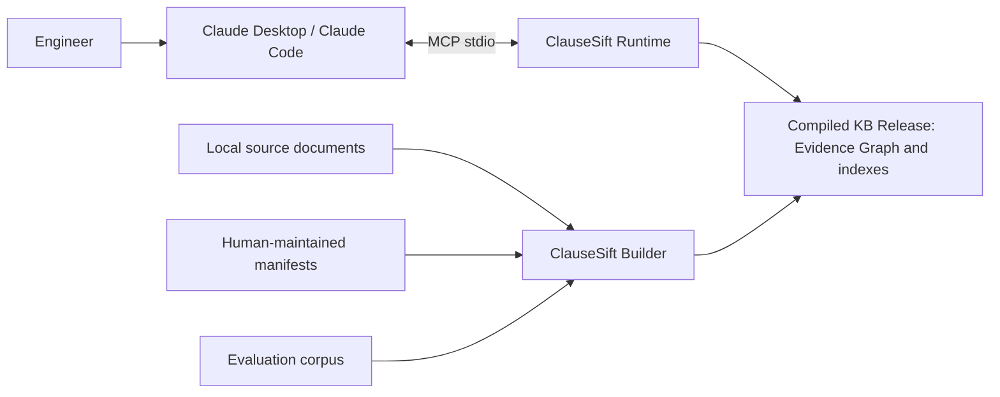
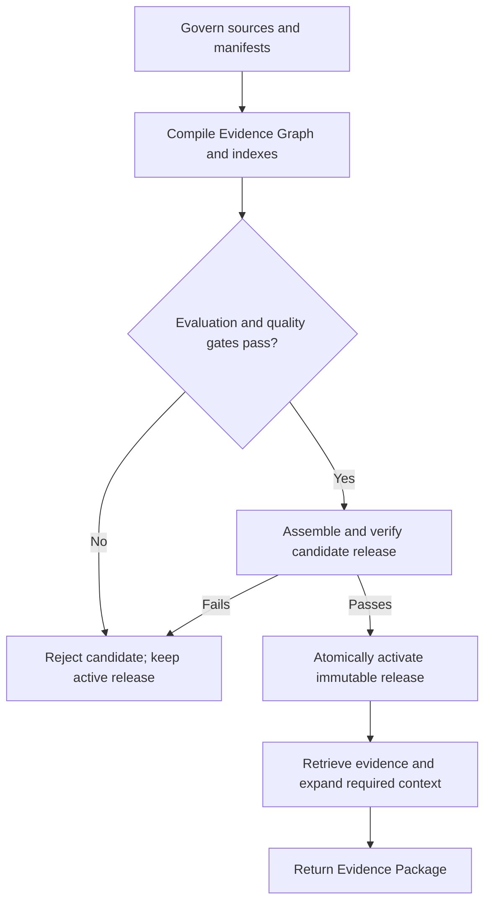

# ClauseSift Design Brief

- **Document version:** 0.2
- **Status:** Product-intent baseline
- **Detailed realization:** [ClauseSift Design Document](design.md)
- **Design rules:** [ClauseSift Design Principles](design-principles.md)

## 1. Purpose

ClauseSift is a local, accuracy-first evidence-retrieval engine for engineering
standards, codes, design guidelines, technical manuals, and product
specifications. Its initial user is a single technical practitioner working with
a relatively small, slowly changing local corpus, initially focused on HVAC,
ventilation, smoke-control, fire-safety, and manufacturer documentation.

Its defining output is not a generated answer. It is a defensible **Evidence
Package** containing the correct source, edition, clause, original text,
applicability context, page citation, provenance, visible uncertainty, and a path
back to the original page. An AI client may interpret that package, but the source
documents remain authoritative.

This brief defines the product intent and boundary. The detailed design defines
the implementation contracts, and the design principles define the rules used to
make or revise those contracts.

## 2. Problem and boundary

Engineering evidence is structurally demanding. Clause identifiers and editions
must remain distinct; source requirements and prohibitions must not be confused
with recommendations, notes, or informative material; requirements need their
parent scope and exceptions; tables need headers, units, and row context; and
every citation must lead back to the original page. The system must also work for
exact identifiers, technical terms, numbers, and natural-language questions while
reporting insufficient or conflicting evidence explicitly.

ClauseSift therefore treats the corpus as versioned engineering evidence, not as
unstructured text for a PDF-chat application.

The first major version does not provide a general chat interface, multi-user
access, enterprise connectors, live document synchronization, collaborative
annotation, agent orchestration, a universal knowledge graph, engineering
calculations, design approval, or legal determinations. It also does not
redistribute proprietary source documents. It retrieves and organizes evidence;
it does not replace professional engineering judgement or statutory review.
Users supply the source documents and remain responsible for their lawful
possession and use.

## 3. Product outcomes

ClauseSift will:

- ingest local standards, codes, guidelines, manuals, and specifications under
  human-reviewed manifests;
- preserve document identity, edition, status, structure, verified source hash,
  page location, and deterministic lineage;
- support exact clause lookup, lexical search, semantic retrieval, metadata
  filtering, fusion, and high-accuracy reranking;
- attach the scope, applicability, definitions, exceptions, notes, tables,
  cross-references, and material conflict positions needed to interpret a hit;
- publish validated, immutable knowledge-base releases that can be activated
  atomically, reproduced, and rolled back; and
- expose one shared read-only runtime through Python, CLI, and MCP without
  requiring external database or search services.

## 4. System context

The AI client is separate from ClauseSift. MCP is an adapter to the same runtime
used by the Python and CLI interfaces; it is not a second retrieval system.

## 5. Major components

| Component | Responsibility |
| --- | --- |
| **Governed inputs** | Local source files, human-reviewed manifests, and a versioned evaluation corpus establish reviewed document identity, applicability, and expected evidence. |
| **Offline builder** | Routes parsers and OCR, creates the canonical document model, resolves structure and references, constructs retrieval units, builds indexes, evaluates quality, and assembles a candidate release. |
| **Canonical Evidence Graph** | Represents source-grounded document nodes and typed structural or semantic relationships. It is a logical model stored in SQLite for v0.1, not a separate graph service. |
| **Immutable release** | Packages the validated catalog, lineage, reports, and the retrieval artifacts enabled for that release under checksums and one release identity. |
| **Read-only runtime** | Analyses queries, searches the active release, fuses and reranks candidates, expands required context and conflicts, and serializes an Evidence Package. |

All build and retrieval components meet at one canonical evidence model and one
public evidence interface.

## 6. End-to-end workflow

During a build, ClauseSift validates source identity, parses each document into a
canonical structure, preserves page provenance, creates
standards-aware chunks and relationships, builds retrieval artifacts, runs the
golden evaluation corpus, and publishes only a passing candidate release.

During a query, the runtime analyses the question and filters, searches the
prebuilt channels, combines and reranks candidates, deterministically adds
required context and all material conflict sides, and returns structured evidence.
The runtime never mutates the active release.

## 7. Evidence Package

Every successful retrieval returns a bounded package that makes four things clear:

- **what was found:** original source-backed text and its evidence role;
- **where it came from:** document, edition, clause, page, and available page
  coordinates;
- **what is needed to interpret it:** scope, applicability, dependencies,
  definitions, exceptions, table context, references, and conflict positions; and
- **how it was produced:** release identity, source/build lineage, retrieval and
  expansion reasons, plus typed warnings for incomplete or uncertain evidence.

Empty evidence is a valid, explicit outcome. Missing context, unresolved
references, parser uncertainty, and conflicts are never repaired or hidden by the
AI client.

## 8. First release and evolution

The first usable release focuses on a small representative corpus and provides:

- Python packaging and a local workspace;
- approved manifests, source-hash validation, canonical structure, and a SQLite
  catalog;
- exact clause lookup and lexical search with metadata filters;
- deterministic citations, required-context expansion, and material-conflict
  closure;
- Python, CLI, and MCP access to the same evidence behavior;
- static review reports, immutable release activation, validation, and rollback;
  and
- regression gates based on real questions and expected evidence.

Hybrid semantic retrieval and reranking follow once exact retrieval is sound.
Later work may add edition comparison, clause mapping, structured product
parameters, and standards-to-product comparison. Parser, OCR, model, index, and
platform choices remain benchmark-driven; licensing and support choices require
explicit governance decisions.

## 9. Success

ClauseSift succeeds when an engineer can ask a realistic question and receive the
right source, edition, clause, page, original text, and complete interpretive
context—with conflicts or insufficiency made visible—through a fast local runtime.
The same inputs must produce the same validated release and evidence behavior, and
an operator must be able to inspect, activate, and roll back releases safely.

The detailed design owns the measurable release gates for retrieval quality,
citation accuracy, context completeness, reproducibility, compatibility,
security, and performance.
