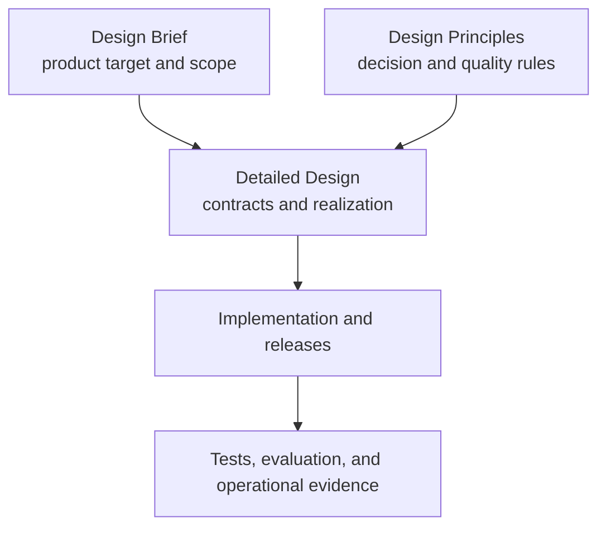

# ClauseSift Design Principles

- **Document version:** 0.1
- **Status:** Design rulebook baseline
- **Product input:** [ClauseSift Design Brief](design-brief.md)
- **Detailed realization:** [ClauseSift Design Document](design.md)

## 1. Purpose

This document is the rulebook for turning the ClauseSift Design Brief into a
detailed design. The brief defines **what** the product must achieve; these
principles define **how** design decisions must be made; the detailed design
records **how the current version realizes and verifies** those decisions.

The principles were extracted from the current detailed design and generalized
where possible into reusable rules. They combine established engineering
practices—such as least privilege, immutable artifacts, strict contracts,
failure atomicity, and evidence-based evaluation—with ClauseSift-specific rules
for source authority, engineering-document semantics, context closure, and
conflict preservation.

## 2. How to use this rulebook

When generating or revising the detailed design:

1. Start from the target, users, scope, components, workflows, and requirements
   in the design brief.
2. Apply every relevant `DP-*` principle to each component boundary, data flow,
   state transition, interface, and quality gate.
3. Make the resulting invariants, ownership, failure behavior, and verification
   method explicit in the detailed design.
4. Cite principle identifiers in future decision records or design reviews when
   they materially constrain a choice.
5. Prefer the smallest design that satisfies the brief and principles; do not
   add infrastructure or abstraction without a demonstrated requirement.

The terms **must**, **must not**, **should**, and **may** express descending
strength. A design may depart from a **should** only with documented evidence and
consequences. A departure from a **must** requires an explicit change to this
rulebook or the design brief, not a local implementation shortcut.

For any exception, record:

- the affected principle IDs;
- the user or system need that cannot otherwise be met;
- evidence supporting the exception;
- new risks and mitigations;
- verification and rollback criteria;
- whether and when the exception expires.

## 3. Decision order

When principles or goals compete, resolve the tradeoff in this order:

1. Protect source fidelity, integrity, safety, and professional-review
   boundaries.
2. Preserve retrieval and contextual correctness.
3. Improve query speed without weakening the first two priorities.
4. Preserve traceability and reproducibility.
5. Prefer operational simplicity and replaceable components.
6. Optimize build speed last.

A lower-priority benefit must not silently relax a higher-priority invariant.

## 4. Product and evidence authority

### DP-01 — Evidence is the product

**Rule:** Design ClauseSift around the Evidence Package, not a fluent answer.

**Why:** An engineering conclusion is defensible only when the user can inspect
the exact source, edition, clause, context, and page behind it.

**Apply:** Make source-backed evidence, citations, lineage, context, conflicts,
and warnings the stable public output. Treat answer generation as a separate
client concern.

**Reject:** Designs that substitute summaries, model prose, or scores for the
original evidence contract.

### DP-02 — Accuracy governs tradeoffs

**Rule:** Accuracy must precede speed, traceability, simplicity, and build speed
in the order defined in Section 3.

**Why:** A fast wrong-edition or out-of-scope result is more dangerous than a
slower complete result.

**Apply:** Measure quality before optimizing; retain validated channels,
candidate depth, and required context until evidence proves a safe change.

**Reject:** Latency optimizations that silently shrink evidence coverage or
weaken a quality gate.

### DP-03 — Original sources remain authoritative

**Rule:** Preserve the authority hierarchy: original source bytes and pages,
deterministic structured representation, normalized text, then generated
retrieval aids.

**Why:** Every transformation can lose or reinterpret information.

**Apply:** Keep original text and page references available, label derived data,
and prohibit generated metadata from overwriting source facts.

**Reject:** Designs in which normalized text, embeddings, summaries, or inferred
metadata become final authority.

### DP-04 — Preserve the professional boundary

**Rule:** Retrieve and organize evidence without asserting engineering approval,
legal enforceability, project-specific applicability, or professional judgment
that the sources do not establish.

**Why:** Document genre, wording, and citation relationships do not independently
prove what binds a particular project.

**Apply:** Preserve issuer, status, modality, applicability, and uncertainty as
separate evidence; leave conclusions to an authorized user or downstream review.

**Reject:** Features that turn source classification or retrieval rank into an
unqualified legal or engineering conclusion.

### DP-05 — Fail visibly

**Rule:** Surface missing, conflicting, ambiguous, corrupt, unsupported, or
insufficient evidence through typed warnings, errors, or refusal.

**Why:** Plausible silent fallback hides exactly the conditions that require
human review.

**Apply:** Define failure states and severity at every boundary and preserve the
diagnostic evidence needed to correct them.

**Reject:** Best-effort behavior that changes meaning, selects another edition,
drops context, or substitutes a different capability without disclosure.

## 5. Semantic modeling and traceability

### DP-06 — Deterministic ownership precedes inference

**Rule:** Human-reviewed manifests, source markers, parsers, schemas, and
versioned deterministic rules must own identity and authoritative source facts.

**Why:** A language model cannot establish document identity, provenance, or
authority merely by producing a plausible value.

**Apply:** Let models rank candidates or propose review items, but require an
admissible deterministic or human-reviewed artifact before changing canonical
data.

**Reject:** Model-written admitted classifications, relationships, citations, or
precedence decisions.

### DP-07 — Keep semantic dimensions orthogonal

**Rule:** Model document identity, genre, lifecycle status, issuer, jurisdiction,
discipline, normative status, source modality, node type, applicability, and
relationships as separate dimensions.

**Why:** Combining dimensions creates misleading aliases such as treating every
standard as binding or every note as informative.

**Apply:** Give each dimension one canonical vocabulary, owner, cardinality, and
provenance rule. Express interactions through explicit relationships.

**Reject:** Composite labels or inference rules that derive one dimension from
another without source authority.

### DP-08 — Represent uncertainty conservatively

**Rule:** Unknown, mixed, unresolved, and unclassified states must remain
explicit and must never be promoted to the nearest stronger value.

**Why:** False certainty is harder to detect than visible incompleteness.

**Apply:** Define conservative fallback values, attach provenance and warnings,
and let release policy decide when uncertainty blocks publication.

**Reject:** Case folding, aliasing, guessing, majority selection, or runtime
promotion that erases ambiguity.

### DP-09 — Make identity stable, scoped, and versioned

**Rule:** Every public document, edition, node, chunk, source, relationship,
occurrence, conflict, cursor, build, and release identity must have a declared
scope and deterministic derivation or ownership rule.

**Why:** Reproducibility and safe joins depend on identities surviving identical
rebuilds while changing when their meaning changes.

**Apply:** Keep editions distinct, bind runtime state to one release, version
identity algorithms, and validate ownership at storage and release boundaries.

**Reject:** Insertion-order IDs, filename authority, implicit “latest” edition
substitution, or identifiers reused after meaning changes.

### DP-10 — Keep the Evidence Graph typed and source-grounded

**Rule:** Treat the Evidence Graph as a storage-neutral logical contract whose
relations have canonical directions, endpoint rules, origins, cardinality, and
cycle policies.

**Why:** The term “graph” must not authorize arbitrary inferred links or require a
particular graph database.

**Apply:** Admit navigable edges only after deterministic construction or exact
human-reviewed authorization; retain unresolved occurrences without creating an
edge.

**Reject:** Generic neighborhood expansion, probabilistic authoritative edges,
or database-specific semantics leaking into the public model.

### DP-11 — Build provenance into every layer

**Rule:** Source, build, retrieval, and assembly provenance must be constructed as
part of each artifact and Evidence Package, not reconstructed after the fact.

**Why:** An evidence item is explainable only if every transformation and
selection can be traced to immutable inputs and rules.

**Apply:** Record approved source hashes, transformation identities, artifact
hashes, selection channels, context paths, and warnings under versioned schemas.

**Reject:** Provenance based only on logs, mutable paths, model explanations, or
best-effort post-processing.

## 6. Architecture and lifecycle

### DP-12 — Compile offline and serve read-only

**Rule:** Perform document-dependent computation during an offline build and keep
normal query execution read-only.

**Why:** The corpus changes infrequently, so precomputation improves runtime
simplicity, repeatability, and isolation.

**Apply:** Parse, normalize, map pages, chunk, resolve relationships, embed,
index, evaluate, and report before publication. At runtime, search and assemble
only verified artifacts.

**Reject:** Query-time mutation of canonical evidence, background source
rewrites, or hidden online ingestion.

### DP-13 — Keep derived artifacts non-authoritative

**Rule:** Lexical indexes, embeddings, vector indexes, caches, scores, and model
outputs must remain rebuildable accelerators.

**Why:** Retrieval machinery may change without changing what the source means.

**Apply:** Derive artifacts from versioned canonical inputs and make the catalog,
source files, and manifests the authority for evidence and identity.

**Reject:** Designs whose only copy of evidence meaning exists inside an index or
model representation.

### DP-14 — Enforce stage-and-gate sequencing

**Rule:** Validate each stage before invoking or caching downstream work.

**Why:** A failed parser, catalog, lineage, evaluation, or integrity condition
must not contaminate later artifacts or a release candidate.

**Apply:** Define explicit preconditions, durable outputs, blocking gates, and
unreachable downstream states for every build stage.

**Reject:** Pipelines that continue after a blocking finding and attempt to clean
up correctness later.

### DP-15 — Persist diagnostics before enforcing failure

**Rule:** Finalize the report or sanitized failure record needed for review before
a gate aborts its workflow.

**Why:** A correct failure that destroys its explanation is not operationally
actionable.

**Apply:** Write bounded, safe parser, catalog, evaluation, and release
diagnostics before evaluating the corresponding terminal gate.

**Reject:** Fail-fast paths that lose the inputs, comparisons, or gate results
needed to reproduce the failure.

### DP-16 — Publish immutable and reproducible releases

**Rule:** A published release must be immutable, content-bound, checksummed, and
byte-reproducible from identical admitted inputs.

**Why:** Audit, rollback, cursor validity, and evidence lineage require one stable
interpretation of a release.

**Apply:** Separate deterministic release content from wall-clock operations,
record complete artifact identities, and change the release identity when any
admitted input or byte changes.

**Reject:** In-place release mutation, nondeterministic release content, or
operational timestamps embedded in content identity without an explicit epoch.

### DP-17 — Make activation atomic and rollback symmetric

**Rule:** Readers must observe either the complete old active-release pointer or
the complete new one, and rollback must use the same durable protocol.

**Why:** Partial activation can combine artifacts from different releases.

**Apply:** Validate a candidate through the read-only runtime, atomically replace
and durably flush the pointer, verify recovery behavior, and retain prior
releases.

**Reject:** Multi-file mutable activation, best-effort pointer updates, or
rollback mechanisms weaker than publication.

### DP-18 — Cache by precise declared dependencies

**Rule:** Each cached artifact must declare and hash exactly the inputs that can
affect its bytes or semantics; a cache hit must bypass no validation gate.

**Why:** Under-invalidation reuses wrong evidence, while flat over-invalidation
makes safe rebuilds unnecessarily expensive.

**Apply:** Use upstream artifact hashes plus direct versions, configurations,
review artifacts, and toolchain identities. Distinguish semantic changes from
forensic byte-only changes.

**Reject:** Filename or source-hash-only caches, whole-corpus keys for unrelated
work, or cache hits treated as proof of current validity.

### DP-19 — Keep implementation components replaceable

**Rule:** Parsers, OCR, lexical engines, embedding models, rerankers, and vector
engines must sit behind stable parser-neutral, canonical, and public contracts.

**Why:** No current tool is guaranteed to remain best for every document or
platform.

**Apply:** Record component identity and version as build inputs, benchmark
alternatives, and require contract conformance before substitution.

**Reject:** Public evidence semantics tied to one vendor, model, index engine, or
storage product.

## 7. Trust, integrity, and privacy

### DP-20 — Treat every external byte as untrusted

**Rule:** Source documents, manifests, parser outputs, release files, cursors,
queries, resource identifiers, and client text must be validated as untrusted
input.

**Why:** Local execution does not remove parser, path, serialization, or resource
exhaustion risks.

**Apply:** Use strict schemas, safe loaders, bounded parsing, parameterized
queries, canonical encodings, and explicit allowlists.

**Reject:** Dynamic deserialization, string-built SQL or paths, permissive unknown
fields, or trust based only on local provenance.

### DP-21 — Isolate high-risk processing with least privilege

**Rule:** Parser and model work must receive only the files, assets, resources,
and network access required for the declared operation.

**Why:** Complex document and model parsers expand the attack and failure surface.

**Apply:** Use supervised isolated processes, no network by default, dedicated
temporary storage, read-only inputs, resource limits, and verified teardown.

**Reject:** Falling back to an unisolated execution when sandbox setup, timeout,
or worker termination fails.

### DP-22 — Verify before opening, importing, or executing

**Rule:** Validate identity, checksum, size, schema, type, ownership, containment,
and safe format before a component consumes an artifact.

**Why:** Validation after deserialization or index opening is too late to prevent
unsafe behavior or mixed-release state.

**Apply:** Verify releases before startup, lazy assets immediately before load,
external originals on the stable opened handle, and database constraints before
query service begins.

**Reject:** Trust-on-first-use of release bytes, unsafe pickle-backed formats, or
path validation separated from the actual file handle used.

### DP-23 — Bound resources and terminal behavior

**Rule:** Every input, queue, traversal, response, model load, worker, deadline,
and shutdown path must have explicit bounds and exactly one terminal outcome.

**Why:** Unbounded work threatens availability; racing completion, cancellation,
timeout, and quarantine threatens protocol correctness.

**Apply:** Validate limits before allocation or enqueue, use atomic admission and
terminal transitions, keep control frames live under saturation, and test race
orders with controllable clocks and barriers.

**Reject:** Unbounded decoded queues, post-allocation size checks, duplicate
responses, partial successes, or wall-clock-sleep race tests.

### DP-24 — Keep data local and disclose minimally

**Rule:** Document and query content must stay local by default, and every public
response, diagnostic, report, and log must expose only necessary safe fields.

**Why:** Engineering corpora may be copyrighted, confidential, or
project-specific.

**Apply:** Require explicit opt-in for external providers, keep credentials out of
artifacts and logs, redact paths before every sink, and separate query and
evidence logging controls.

**Reject:** Implicit external transmission, absolute-path disclosure, raw
exception text, credentials in configuration artifacts, or content logging by
default.

### DP-25 — Fail closed on integrity loss

**Rule:** An integrity failure must stop admission, prevent new success, and
require repair or explicit rollback rather than silent degradation.

**Why:** Continuing after a changed or unverified artifact can produce evidence
from an incoherent release.

**Apply:** Refuse startup for invalid releases and quarantine a serving process
when a lazy artifact fails verification; settle bounded pending work and exit
non-zero.

**Reject:** Automatic fallback to a partially readable release, another release,
or an unverified capability.

## 8. Retrieval, context, and model use

### DP-26 — Keep exact and lexical retrieval first-class

**Rule:** Exact identifiers, metadata filters, numbers, and lexical terms must
remain independently useful retrieval channels.

**Why:** Engineering questions frequently contain codes, clause numbers, model
numbers, and values that semantic similarity can blur.

**Apply:** Design exact and lexical paths before dense retrieval, fuse channels
without erasing their provenance, and evaluate each channel separately.

**Reject:** Embedding-only retrieval or semantic fallback for a failed exact
identity contract.

### DP-27 — Let modes change acceleration, not evidence semantics

**Rule:** Retrieval modes may change candidate selection and reranking, but must
share identity, citation, required-context, warning, and Evidence Package rules.

**Why:** A user choosing a faster mode does not consent to incomplete or
differently interpreted evidence.

**Apply:** Resolve capabilities explicitly, report unavailable features, and run
required context closure for every ordinary evidence-returning mode.

**Reject:** Mode-specific evidence schemas, silent capability downgrade, or fast
modes that omit required applicability or exceptions.

### DP-28 — Treat context completeness as correctness

**Rule:** Required scope, applicability, dependencies, definitions, exceptions,
table context, and material conflict positions must be closed under deterministic
bounded traversal.

**Why:** A locally relevant sentence may be materially misleading in isolation.

**Apply:** Version traversal rules, canonical directions, context classes,
ordering, cycle policy, and bounds; retain every accepted path and explicit
incompleteness warning.

**Reject:** Fixed previous/next windows, arbitrary graph neighborhoods, or model
decisions that required context is unnecessary.

### DP-29 — Preserve disagreement without inventing precedence

**Rule:** Keep every material side of a conflict and select a controlling position
only when an encoded, source-grounded precedence rule supports it.

**Why:** Retrieval rank, recency, document type, or model confidence does not
establish which engineering source controls.

**Apply:** Distinguish explained differences, confirmed conflicts, unresolved
candidates, and reviewed precedence; serialize all positions with source and
lineage.

**Reject:** Majority vote, highest-rank wins, newest-document wins, or model-only
conflict confirmation.

### DP-30 — Use models as replaceable assistants

**Rule:** Models may improve parsing proposals, semantic candidate retrieval, or
reranking, but must not create source authority or bypass deterministic gates.

**Why:** Model quality, availability, latency, and packaging constraints change
over time.

**Apply:** Keep model inputs and outputs bounded, versioned, attributable,
optional where the product mode allows, and evaluated against source-grounded
fixtures.

**Reject:** A model as the sole parser validator, citation generator,
classification authority, relationship author, or release grader.

## 9. Public contracts and quality engineering

### DP-31 — Expose one shared strict evidence contract

**Rule:** Python, CLI, and MCP must use the same validated runtime semantics and
central serialization rules.

**Why:** Separate interface implementations drift in filters, errors, warnings,
and source disclosure.

**Apply:** Define strict request and response schemas, closed enums, field and
length bounds, typed errors, safe detail allowlists, and one Evidence Package
serializer.

**Reject:** Interface-specific business logic, permissive extra fields, raw
exception serialization, or prose-only error conventions.

### DP-32 — Version behavior explicitly and fail unknown

**Rule:** Version every behavior-bearing vocabulary, schema, rule set, identity
algorithm, cache contract, release contract, and protocol compatibility path.

**Why:** Existing release bytes must retain their original meaning when software
and vocabularies evolve.

**Apply:** Maintain explicit supported-version allowlists, bind versions and
configuration hashes into dependent artifacts, and test each supported protocol
era independently.

**Reject:** Silent aliases, case folding, guessed future meanings, or treating a
new core value as automatically backward compatible.

### DP-33 — Make output deterministic and resumable

**Rule:** Equivalent release, request, and mode inputs must produce stable
ordering, deduplication, paths, warnings, pagination, and serialized bytes where
the contract declares determinism.

**Why:** Repeatability is necessary for audit, regression testing, and safe client
pagination.

**Apply:** Declare total ordering and tie-break rules, bind cursors to filters and
release identity, use canonical serialization, and reject mismatched resume
state.

**Reject:** Database insertion order, hash-map order, unstable ties, offset
pagination over changing state, or cursors reusable across releases.

### DP-34 — Let evidence choose components and thresholds

**Rule:** Select parsers, OCR, tokenization, models, indexes, candidate sizes, and
release thresholds through representative evaluation rather than preference.

**Why:** Component quality varies by document type, language, structure, and
question class.

**Apply:** Maintain real engineering questions, representative documents, hard
negatives, parser comparisons, static review reports, and attributable metrics.

**Reject:** Permanent component choices based only on popularity, benchmark
averages from another domain, latency, or anecdote.

### DP-35 — Match the proof method to the claim

**Rule:** Use complete zero-failure conformance suites for deterministic
contracts and preregistered statistical methods for sampled quality claims.

**Why:** A finite sample cannot prove population perfection, while deterministic
invariants should not be weakened into average percentages.

**Apply:** Report numerators and denominators, confidence intervals, coverage,
grader ownership and reliability, negative cases, and every gate failure.

**Reject:** Unqualified percentages, average-only safety claims, self-grading
models as sole authority, or a release passing when its confidence bound misses
the declared target.

### DP-36 — Test boundaries, failures, and recovery as first-class behavior

**Rule:** Verification must cover happy paths, exact bounds, one-over bounds,
invalid states, adverse ordering, races, crashes, recovery, and rollback.

**Why:** ClauseSift's strongest guarantees are exercised when data, tools, or
processes fail.

**Apply:** Combine unit, integration, regression, packaging, security, and
failure-injection tests; assert both the returned outcome and forbidden side
effects.

**Reject:** Tests that cover only successful examples, rely on real-time sleeps
for races, or assert an error without checking that downstream work and active
state remained unchanged.

### DP-37 — Observe reproducibly without changing or leaking the system

**Rule:** Builds and runtime stages must be diagnosable through deterministic
artifact metadata and redacted operational telemetry that never mutates an
immutable release.

**Why:** Debugging needs timings, versions, hashes, warnings, and state transitions
without exposing sensitive content or making builds nondeterministic.

**Apply:** Separate deterministic build records from wall-clock lifecycle logs,
measure stage latency and load state, redact before dispatch, and keep query or
evidence text logging independently opt-in.

**Reject:** Mutable release logs, secrets or paths in telemetry, unsegmented
average latency, or operational run IDs inside reproducible content identity.

### DP-38 — Optimize only after quality gates pass

**Rule:** Performance work must follow demonstrated correctness and must preserve
all validated quality and integrity gates.

**Why:** Premature optimization tends to remove the candidate depth, context, or
validation that makes engineering evidence defensible.

**Apply:** Measure exact, lexical, dense, fusion, reranking, context, loading, and
end-to-end latency separately; optimize caching and execution before considering
quality-changing approximations.

**Reject:** Approximate search, channel removal, context reduction, or unsafe lazy
loading introduced solely to meet an unvalidated latency target.

## 10. Detailed-design generation checklist

Before a generated or revised detailed design is accepted, verify that it:

- states the product outcome and professional boundary from the brief;
- identifies the authority, owner, vocabulary, and provenance of every fact;
- separates canonical evidence from derived acceleration artifacts;
- defines stable identities and version transitions;
- names trust boundaries and validates data before use;
- defines resource limits before allocation, enqueue, or traversal;
- makes every state transition, failure, cancellation, and recovery path
  terminal and testable;
- preserves required context, conflicts, and uncertainty across every retrieval
  mode;
- keeps public interfaces strict, consistent, deterministic, and minimally
  disclosive;
- orders build work so a failed gate cannot contaminate downstream artifacts;
- persists actionable diagnostics before aborting;
- defines immutable publication, atomic activation, and rollback;
- ties replaceable component choices to evaluation evidence;
- separates deterministic conformance claims from sampled statistical claims;
- specifies tests for happy paths, negative cases, limits, races, crashes, and
  forbidden side effects;
- defines observability that preserves privacy and reproducibility;
- records every deliberate exception to a `DP-*` principle.

## 11. Principle-to-design traceability

| Principle group | Detailed design sections |
| --- | --- |
| Product and evidence authority (`DP-01`-`DP-05`) | Sections 1-6, 21, and 31 |
| Semantic modeling and traceability (`DP-06`-`DP-11`) | Sections 7, 10, 12-14, and 19-21 |
| Architecture and lifecycle (`DP-12`-`DP-19`) | Sections 7-9 and 24-27 |
| Trust, integrity, and privacy (`DP-20`-`DP-25`) | Sections 11, 14, 22, 27, and 31-33 |
| Retrieval, context, and model use (`DP-26`-`DP-30`) | Sections 15-20 and 27 |
| Public contracts and quality (`DP-31`-`DP-38`) | Sections 21-38 |

When the detailed design adds a new component, workflow, authority class,
behavior-bearing extension, or trust boundary, review this rulebook first. Add a
new principle only when the rule is cross-cutting and durable; keep one-off
technical details in the detailed design or an implementation decision record.
