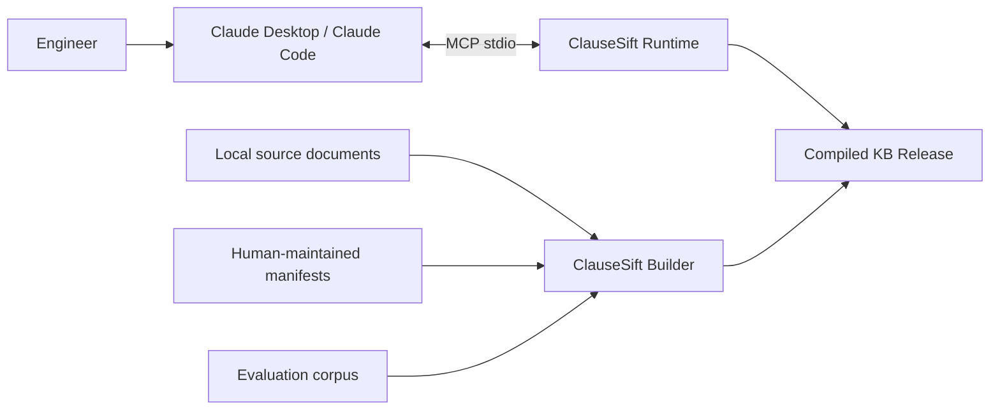
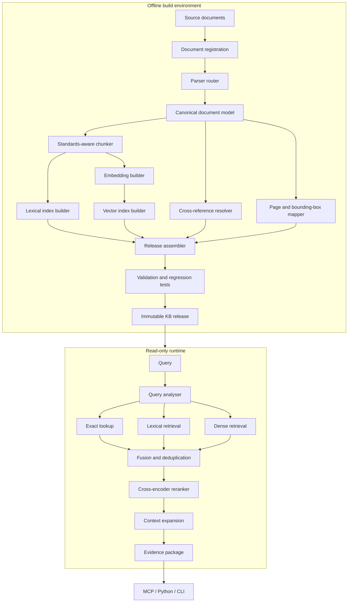

# ClauseSift Design Document

**Document version:** 0.1  
**Status:** Initial design baseline  
**Project:** ClauseSift  
**Repository:** `grammy-jiang/clause-sift`  
**Primary implementation language:** Python  

## 1. Executive summary

ClauseSift is an accuracy-first evidence retrieval engine for engineering standards, codes, design guidelines, technical manuals, and product specifications.

The initial use case is local retrieval across HVAC, ventilation, smoke-control, fire-safety, and manufacturer documentation. The system is intended for a single technical user and a relatively stable document corpus, with most documents changing no more than once per year.

ClauseSift is deliberately not designed as a general-purpose chat platform. Its primary output is a structured evidence package containing the correct document, edition, clause, context, page location, and original text. An AI client such as Claude Desktop or Claude Code may then interpret that evidence through an MCP interface.

The system adopts the following priority order:

1. Accuracy.
2. Query speed.
3. Traceability and reproducibility.
4. Operational simplicity.
5. Build speed.

The central architectural decision is to separate the system into two parts:

- an offline knowledge-base compiler that performs expensive parsing, OCR, structural analysis, chunking, embedding, indexing, validation, and release generation;
- a lightweight, read-only runtime that loads a compiled knowledge-base release and serves evidence through a Python API, CLI, and MCP server.

This design allows ClauseSift to use slow, high-quality processing during infrequent document builds while keeping normal query operations fast and operationally simple.

---

## 2. Problem statement

Engineering design work frequently requires repeated consultation of several document classes:

- mandatory or referenced standards;
- codes and regulations;
- recommended design guidelines;
- technical manuals;
- manufacturer product specifications;
- superseded editions retained for historical projects;
- tables, appendices, figures, notes, exceptions, and cross-references.

General RAG platforms can ingest these documents, but they usually introduce infrastructure and abstractions that are unnecessary for this use case, including multi-user management, persistent task queues, object storage services, chat interfaces, agent orchestration, and online document synchronization.

More importantly, generic RAG systems often treat documents as unstructured text. Engineering standards require stronger guarantees:

- clause numbers must be preserved;
- document editions must not be mixed;
- mandatory requirements must be distinguished from guidance and notes;
- exceptions and parent scope conditions must accompany isolated requirements;
- table headers, units, and row context must survive extraction;
- citations must resolve to an original page and, where possible, a bounding box;
- retrieval must work for exact identifiers, technical terms, numbers, and natural-language questions;
- the system must explicitly report insufficient or conflicting evidence.

ClauseSift addresses this problem as an evidence-retrieval system rather than a PDF-chat application.

---

## 3. Goals

ClauseSift shall:

1. Ingest local engineering standards, codes, guidelines, manuals, and product specifications.
2. Preserve document identity, edition, status, jurisdiction, type, and source hash.
3. Preserve document structure down to clause, subclause, note, exception, table, and appendix level where possible.
4. Support exact identifier lookup, lexical retrieval, semantic retrieval, and reranking.
5. Return original source text with deterministic citations.
6. Expand retrieved evidence with relevant parent scope, exceptions, notes, tables, and cross-references.
7. Support immutable, versioned knowledge-base releases.
8. Allow release validation and rollback.
9. Expose retrieval through a Python library, command-line interface, and MCP server.
10. Operate locally without requiring MySQL, Redis, MinIO, Elasticsearch, or a permanently running vector database.
11. Be distributable as a standard Python installation package.
12. Permit parser, embedding, lexical-index, vector-index, and reranker components to be replaced through stable interfaces.
13. Include a regression-evaluation framework based on real engineering questions and expected evidence.

---

## 4. Non-goals

The first major version will not attempt to provide:

- multi-user authentication or authorization;
- a general-purpose web chat interface;
- enterprise document connectors;
- real-time document synchronization;
- collaborative annotation;
- a generic agent workflow engine;
- long-term conversational memory;
- automatic legal determination of whether a document is enforceable;
- complete HVAC or fire-engineering calculations;
- autonomous approval of engineering designs;
- a universal knowledge graph;
- automatic redistribution of copyrighted standards or specifications.

ClauseSift retrieves and organizes evidence. It does not replace professional engineering judgement or statutory review.

---

## 5. Core design principles

### 5.1 Accuracy before speed

ClauseSift shall not improve latency by silently removing retrieval channels, shrinking candidate pools below validated thresholds, dropping contextual clauses, or replacing original evidence with generated summaries.

Performance optimization begins only after retrieval and citation quality meet defined quality gates.

### 5.2 Original documents remain authoritative

The evidence hierarchy is:

1. original source page;
2. deterministic structured representation;
3. normalized text;
4. generated metadata, summaries, keywords, or query expansions.

Generated content may improve retrieval but must not become the final authority for an engineering conclusion.

### 5.3 Offline compilation, read-only runtime

All document-dependent computation that can be performed once shall be performed during a build:

- parsing and OCR;
- layout analysis;
- clause-tree construction;
- text normalization;
- chunk construction;
- table expansion;
- cross-reference extraction;
- document embeddings;
- lexical indexing;
- vector indexing;
- page rendering and coordinate mapping;
- validation and regression tests.

At query time, the runtime should only:

- analyse the query;
- apply metadata filters;
- compute query embeddings when needed;
- search prebuilt indexes;
- fuse and rerank candidates;
- expand evidence context;
- return structured evidence.

### 5.4 Deterministic rules before LLM inference

The following should be supplied by manifests, parsers, rules, or human review rather than inferred freely by an LLM:

- document identifier;
- edition;
- authority;
- status;
- jurisdiction;
- document type;
- clause number;
- page number;
- file hash;
- supersession relationship;
- citation string.

### 5.5 Immutable knowledge-base releases

A published knowledge-base release is read-only. Updates produce a new release, which is validated before an atomic switch of the active release pointer.

This model supports reproducibility, rollback, and auditability.

### 5.6 Replaceable components

Parsers, embedding models, rerankers, and index engines are implementation choices, not permanent parts of the public data model.

The canonical document model and evidence API must remain stable when individual components change.

### 5.7 Fail visibly

Parser anomalies, unresolved references, low-confidence OCR, conflicting editions, and incomplete applicability conditions must be surfaced as warnings or build failures. They must not be hidden behind a plausible answer.

---

## 6. System context



ClauseSift does not require the AI client to be bundled with the package. The MCP server is an adapter between the client and the evidence-retrieval runtime.

---

## 7. High-level architecture



---

## 8. Package and distribution design

### 8.1 Distribution names

- PyPI distribution: `clausesift`
- Python import package: `clausesift`
- CLI command: `clausesift`
- Repository: `clause-sift`

### 8.2 Installation profiles

The package should use optional dependency groups so that the query runtime does not require heavy parsing and OCR dependencies.

Proposed usage:

```bash
pip install clausesift
pip install "clausesift[build]"
pip install "clausesift[ocr]"
pip install "clausesift[rerank]"
pip install "clausesift[all]"
```

Proposed semantic meaning:

- base: runtime, SQLite catalog, lexical search, exact vector search, CLI, and MCP;
- `build`: standard document parsing and release building;
- `ocr`: heavyweight OCR and difficult-document fallbacks;
- `rerank`: local cross-encoder models;
- `all`: all officially supported optional components.

### 8.3 Runtime/build dependency separation

The runtime package must not import parser or OCR modules during normal startup. Builder-specific code should be loaded only when build commands are invoked.

This prevents a simple MCP runtime from inheriting the memory footprint and installation complexity of the offline pipeline.

---

## 9. Proposed repository layout

```text
clause-sift/
├── docs/
│   ├── design.md
│   ├── canonical-model.md
│   ├── retrieval.md
│   ├── mcp-api.md
│   └── evaluation.md
├── src/
│   └── clausesift/
│       ├── __init__.py
│       ├── cli.py
│       ├── config/
│       ├── model/
│       ├── builder/
│       │   ├── parsers/
│       │   ├── normalisation/
│       │   ├── chunking/
│       │   ├── references/
│       │   ├── lexical/
│       │   ├── embeddings/
│       │   ├── vector/
│       │   ├── reports/
│       │   └── release/
│       ├── runtime/
│       │   ├── catalog/
│       │   ├── query/
│       │   ├── retrieval/
│       │   ├── reranking/
│       │   ├── context/
│       │   └── evidence/
│       ├── mcp/
│       └── evaluation/
├── tests/
│   ├── unit/
│   ├── integration/
│   └── regression/
├── examples/
├── pyproject.toml
├── README.md
├── LICENSE
└── CHANGELOG.md
```

The first implementation may use fewer modules, but public boundaries between builder, runtime, evidence model, and MCP should be preserved.

---

## 10. Source corpus and manifests

### 10.1 Source files

Source documents are stored outside the Python package and are never included in the published wheel or source distribution.

A typical user workspace may contain:

```text
workspace/
├── corpus/
│   ├── inbox/
│   ├── originals/
│   └── manifests/
├── cache/
├── releases/
└── current
```

### 10.2 Copyright boundary

ClauseSift distributes software only. It must not bundle proprietary standards, manufacturer documents, or user corpora.

Users are responsible for possessing and using source documents lawfully.

### 10.3 Document manifest

Each document should have a human-reviewed manifest.

Example:

```yaml
document_id: as-1668-1-2015
title: AS 1668.1:2015
document_code: AS 1668.1
edition: "2015"
authority: Standards Australia
document_type: mandatory_standard
jurisdictions:
  - Australia
disciplines:
  - hvac
  - smoke_control
  - fire_safety
status: active
effective_from: null
supersedes: null
superseded_by: null
language: en
source_file: corpus/originals/AS1668.1-2015.pdf
sha256: null
```

### 10.4 Initial document types

- `mandatory_standard`
- `referenced_standard`
- `code_or_regulation`
- `design_guideline`
- `technical_manual`
- `manufacturer_specification`
- `research_reference`
- `superseded_document`

Document type is part of evidence and affects how an AI client should describe the source.

---

## 11. Parser architecture

### 11.1 Parser router

No parser is assumed to be best for every document.

The parser router chooses a path according to document characteristics and user configuration.

Initial candidate paths:

- Docling for structured standards and ordinary technical PDFs;
- PyMuPDF-based extraction for deterministic page text and coordinate comparison;
- MinerU or another OCR pipeline for scanned or difficult documents;
- dual-parser comparison for critical documents.

No parser selection becomes permanent until it is measured against the project evaluation corpus.

### 11.2 Parser contract

Every parser adapter must produce a parser-neutral intermediate representation containing, where available:

- pages and page dimensions;
- blocks and reading order;
- headings and hierarchy;
- paragraphs and lists;
- tables and cells;
- figures and captions;
- footnotes;
- source page numbers;
- bounding boxes;
- original extracted text;
- OCR status and confidence;
- parser warnings.

### 11.3 Parser validation

The builder should test:

- source and parsed page counts;
- missing-text ratios;
- abnormal-character ratios;
- heading-tree consistency;
- clause-number continuity;
- duplicated header/footer text;
- cross-page paragraph continuity;
- table shape consistency;
- unresolved page coordinates;
- differences between two parser outputs when comparison mode is enabled.

A critical document that fails configured quality thresholds must not enter a production release.

---

## 12. Canonical document model

The canonical document model isolates the rest of ClauseSift from parser-specific output formats.

### 12.1 Core node fields

```text
node_id
document_id
node_type
parent_node_id
previous_node_id
next_node_id
heading
heading_path
clause_number
page_start
page_end
bounding_boxes
original_text
normalized_text
parser_source
parser_confidence
attributes
```

### 12.2 Initial node types

- `document`
- `part`
- `chapter`
- `section`
- `clause`
- `subclause`
- `paragraph`
- `requirement`
- `definition`
- `exception`
- `note`
- `table`
- `table_row`
- `figure`
- `caption`
- `appendix`
- `footnote`

### 12.3 Text variants

Each searchable unit may include:

- `original_text`: source-faithful text returned as evidence;
- `normalized_text`: repaired line breaks, hyphenation, and whitespace;
- `search_text`: normalized text plus deterministic document and hierarchy context;
- `embedding_text`: text formatted for the selected embedding model.

Search-enriched text must not replace original evidence text.

---

## 13. Standards-aware chunking

### 13.1 Chunk boundaries

Preferred boundaries are:

1. complete clause or subclause;
2. complete requirement plus its directly attached exception or note metadata;
3. complete table or logically independent table row;
4. semantically complete paragraph;
5. token-limit split as a last resort.

Fixed-size character chunking is not the primary strategy.

### 13.2 Chunk fields

```text
chunk_id
document_id
document_version
node_ids
clause_number
heading_path
node_type
page_start
page_end
parent_chunk_id
previous_chunk_id
next_chunk_id
original_text
search_text
embedding_text
```

### 13.3 Context integrity

The chunker must preserve or link:

- scope conditions inherited from parent clauses;
- exceptions;
- notes and their informative status;
- table titles, headers, and units;
- normative versus informative appendices;
- source pages and bounding boxes;
- previous and next logical units.

### 13.4 Tables

Tables should create at least two searchable representations:

1. a whole-table representation;
2. row-level representations that repeat table title, headers, units, and parent clause context.

Table extraction confidence should be carried into evidence warnings.

---

## 14. Catalog and storage

### 14.1 SQLite as the authoritative catalog

SQLite should store:

- document manifests;
- versions and status;
- canonical nodes;
- chunks and text variants;
- page and bounding-box mappings;
- cross-references;
- build metadata;
- parser warnings;
- release metadata;
- evaluation results;
- optional query logs.

SQLite is the source of truth for structured knowledge-base metadata.

### 14.2 Rebuildable indexes

Lexical and vector indexes are derived artifacts. They must be reconstructable from the canonical model and catalog.

### 14.3 Original files

Original files remain in the user workspace. The catalog stores paths and hashes but does not replace the original source.

---

## 15. Lexical retrieval

Lexical retrieval is mandatory because engineering queries frequently contain exact tokens that dense models can blur:

- document codes;
- clause identifiers;
- table numbers;
- product model numbers;
- numbers and units;
- abbreviations;
- exact phrases.

Candidate engines include:

- Tantivy bindings;
- BM25S;
- SQLite FTS5.

The initial implementation will select an engine after benchmarking:

- English and Chinese retrieval;
- punctuation and unit tokenisation;
- field weighting;
- index size;
- load time;
- reproducibility;
- Python packaging complexity.

The public retrieval interface must not depend on a specific lexical engine.

---

## 16. Dense retrieval

### 16.1 Offline document embeddings

All document and chunk embeddings are generated during a build and stored in the release.

Changing the embedding model or revision invalidates the affected vector artifacts.

### 16.2 Runtime query embeddings

Only the current query is embedded at runtime.

The query model may be loaded lazily when semantic retrieval is first requested.

### 16.3 Exact search first

For small and medium local corpora, ClauseSift should prefer exact cosine or dot-product search over approximate nearest-neighbour search.

A normalized vector matrix may be memory-mapped and searched as:

```python
scores = embeddings @ query_vector
```

Approximate indexing should be introduced only when measured latency justifies it and recall loss has been quantified.

### 16.4 Candidate scale guidance

These are starting hypotheses, not hard limits:

- under approximately 50,000 chunks: NumPy memory-mapped exact search;
- approximately 50,000 to 300,000 chunks: NumPy or FAISS exact search;
- larger corpora or validated latency constraints: evaluate ANN indexes.

Actual thresholds must be determined on target hardware.

### 16.5 Embedding model selection

Embedding models must be benchmarked on the project corpus, including:

- English standards;
- Chinese standards;
- cross-language queries;
- HVAC and fire-safety terminology;
- identifiers and product models;
- numbers and units;
- synonyms;
- negation and exception queries.

No embedding model is considered permanent without evaluation evidence.

---

## 17. Query analysis and retrieval modes

### 17.1 Query analysis

Deterministic analysis should detect:

- document codes;
- clause numbers;
- editions;
- product model numbers;
- numbers and units;
- document types;
- jurisdiction and discipline filters;
- version-comparison intent;
- source-page requests.

### 17.2 Retrieval modes

#### Exact mode

For explicit document, clause, model, or numeric queries:

```text
metadata filtering
+ exact identifier lookup
+ lexical retrieval
```

No embedding or reranker is required unless exact retrieval is ambiguous.

#### Hybrid mode

For natural-language questions:

```text
lexical retrieval
+ dense retrieval
+ rank fusion
```

#### High-accuracy mode

For complex, cross-document, or applicability-sensitive questions:

```text
exact lookup
+ lexical retrieval
+ dense retrieval
+ fusion
+ cross-encoder reranking
+ context expansion
```

The runtime may select a mode automatically, but the API must allow an explicit mode override.

---

## 18. Candidate fusion and reranking

A starting high-accuracy pipeline is:

```text
exact identifier matches
lexical top 30-50
dense top 30-50
        ↓
deduplication and reciprocal-rank fusion
        ↓
cross-encoder reranking of top 20-30
        ↓
final evidence candidates: top 8-12
```

These numbers are initial parameters. They must be adjusted through Recall@K and end-to-end evaluation rather than latency preference alone.

The reranker may be loaded lazily. High-value engineering queries should retain the option to invoke it even when it increases latency.

---

## 19. Context expansion

A relevant sentence is not necessarily sufficient evidence.

After retrieval, ClauseSift should inspect document structure and attach required context, including:

- parent scope clauses;
- definitions;
- exceptions;
- notes;
- referenced tables;
- linked clauses;
- normative appendices;
- previous or next logical units where required.

Context expansion is structure-driven rather than a fixed previous/next chunk window.

Example rule:

```text
retrieved requirement
    → include clause heading
    → inspect parent applicability condition
    → include sibling exception
    → include referenced table
    → resolve directly referenced clause
```

---

## 20. Cross-reference model

The build pipeline should detect deterministic references such as:

- `refer to Clause 4.2`;
- `subject to Section 5`;
- `except as permitted by Table 3.1`;
- `in accordance with AS/NZS 1668.2`.

Proposed fields:

```text
source_node_id
target_document_code
target_clause
relation_type
resolution_status
raw_reference_text
```

Initial relation types:

- `references`
- `depends_on`
- `exception_to`
- `defines`
- `supersedes`
- `amends`
- `applies_subject_to`

The first release will use relational cross-reference data, not a generic graph database.

---

## 21. Evidence package

ClauseSift returns structured evidence, not only prose.

Example:

```json
{
  "query": "When may mechanical smoke exhaust be omitted?",
  "retrieval_mode": "hybrid_rerank",
  "release": "2026.08",
  "evidence": [
    {
      "source_id": "src-001",
      "document_id": "as-1668-1-2015",
      "document_code": "AS 1668.1",
      "edition": "2015",
      "document_type": "mandatory_standard",
      "status": "active",
      "clause": "4.6.2",
      "heading_path": [
        "Smoke-control systems",
        "Fan operation"
      ],
      "node_type": "requirement",
      "page_start": 47,
      "page_end": 47,
      "text": "...",
      "citation": "[AS 1668.1:2015, cl. 4.6.2, p.47]",
      "bounding_boxes": [],
      "retrieval_channels": [
        "lexical",
        "dense"
      ],
      "rerank_score": 0.91,
      "source_file_hash": "sha256:...",
      "warnings": []
    }
  ],
  "warnings": [
    "Applicability depends on building classification."
  ]
}
```

Citation fields are generated programmatically. The AI client must not invent or repair missing citations.

---

## 22. MCP interface

The first runtime uses the official Python MCP SDK and local `stdio` transport.

### 22.1 Initial tools

#### `search_evidence`

```python
search_evidence(
    query: str,
    document_codes: list[str] | None = None,
    document_types: list[str] | None = None,
    editions: list[str] | None = None,
    jurisdictions: list[str] | None = None,
    disciplines: list[str] | None = None,
    status: str | None = "active",
    mode: str = "auto",
    limit: int = 10,
)
```

#### `get_clause`

```python
get_clause(
    document_id: str,
    clause_number: str,
)
```

#### `get_context`

```python
get_context(
    source_id: str,
    include_parent: bool = True,
    include_exceptions: bool = True,
    include_notes: bool = True,
    include_tables: bool = True,
    include_references: bool = True,
)
```

#### `get_document_metadata`

```python
get_document_metadata(document_id: str)
```

#### `list_documents`

```python
list_documents(
    document_type: str | None = None,
    status: str | None = None,
    discipline: str | None = None,
)
```

#### `get_page_reference`

```python
get_page_reference(
    document_id: str,
    page_number: int,
)
```

### 22.2 Future tools

- `compare_document_versions`
- `resolve_cross_reference`
- `search_tables`
- `search_product_specifications`
- `get_product_parameter`
- `validate_citation`

### 22.3 MCP resources

Proposed resource URIs:

```text
standards://document/{document_id}
standards://clause/{document_id}/{clause_number}
standards://source/{source_id}
standards://page/{document_id}/{page_number}
standards://release/current
```

---

## 23. CLI design

Initial command surface:

```bash
clausesift init <workspace>
clausesift ingest <path>
clausesift build
clausesift validate
clausesift release
clausesift list-documents
clausesift search <query>
clausesift get-clause <document-id> <clause>
clausesift mcp
```

The CLI and MCP server must call the same runtime service layer rather than implementing separate retrieval logic.

---

## 24. Build pipeline

The intended build sequence is:

1. Scan the inbox and registered source files.
2. Calculate source hashes.
3. Load and validate manifests.
4. Detect added, changed, and removed documents.
5. Select parser routes.
6. Produce canonical documents.
7. Run parsing validation.
8. Construct clause and node trees.
9. Generate standards-aware chunks.
10. Extract and resolve cross-references.
11. Generate lexical and embedding text.
12. Generate document embeddings.
13. Build lexical indexes.
14. Build vector artifacts.
15. Build page and bounding-box mappings.
16. Generate static review reports.
17. Run regression evaluation.
18. Assemble a release.
19. Validate the release manifest and checksums.
20. Publish the release and atomically update the active pointer.

A failed build must leave the active release unchanged.

---

## 25. Build cache and invalidation

A source file hash alone is not sufficient for build caching.

The cache identity should include:

```text
source_file_hash
parser_name
parser_version
parser_configuration
ocr_configuration
normalizer_version
chunker_version
embedding_model
embedding_model_revision
lexical_index_version
schema_version
```

Changes to any relevant value may invalidate downstream artifacts even when the source PDF is unchanged.

---

## 26. Release format

A compiled release may use the following layout:

```text
releases/
└── 2026.08/
    ├── manifest.json
    ├── build-info.json
    ├── knowledge.sqlite
    ├── chunks.jsonl
    ├── embeddings.f16.npy
    ├── lexical-index/
    ├── vector-index/
    ├── documents/
    ├── pages/
    ├── reports/
    └── evaluation-results.json
```

The release manifest records:

- release identifier;
- build timestamp;
- document and chunk counts;
- schema version;
- parser and chunker versions;
- embedding model and revision;
- vector dimensions and dtype;
- index engine versions;
- source and artifact checksums;
- evaluation summary.

The active release may be represented by a symlink or platform-neutral pointer file.

---

## 27. Runtime loading strategy

ClauseSift should use memory mapping and operating-system page caching instead of eagerly copying the complete knowledge base into process memory.

Recommended strategy:

- compact document metadata: load at startup or rely on SQLite page cache;
- chunk text: read from SQLite on demand;
- dense vectors: NumPy memory map;
- lexical index: open as a disk-backed index;
- query embedding model: lazy load;
- reranker: lazy load only for high-accuracy queries;
- original PDF pages: open only when source inspection is requested.

This design retains fast warm queries without creating unnecessary startup memory pressure.

---

## 28. Static review reports

Each imported document should produce a static HTML report, without requiring a web application.

The report should expose:

- document metadata;
- heading and clause tree;
- parser output;
- chunk boundaries;
- original and normalized text;
- rendered source page;
- bounding boxes;
- table structure;
- OCR status;
- parser and validation warnings;
- extracted cross-references.

This provides the most valuable document-inspection capability of a large RAG platform without its operational infrastructure.

---

## 29. Evaluation strategy

### 29.1 Golden question set

The evaluation corpus should contain real questions covering:

- exact document identifiers;
- exact clause identifiers;
- definitions;
- scope and applicability;
- mandatory requirements;
- exceptions;
- informative notes;
- table values and units;
- product model numbers and parameters;
- cross-clause references;
- cross-document references;
- version differences;
- unanswerable questions;
- ambiguous questions;
- questions likely to trigger unsupported inference;
- English, Chinese, and cross-language queries.

### 29.2 Retrieval metrics

- Recall@5
- Recall@10
- Recall@20
- Mean Reciprocal Rank
- nDCG
- correct-document rate
- correct-edition rate
- correct-clause rate
- correct-page rate
- table-evidence hit rate

### 29.3 End-to-end metrics

- citation accuracy;
- evidence support rate;
- unsupported assertion rate;
- refusal accuracy;
- version-selection accuracy;
- document-type interpretation accuracy;
- context completeness.

### 29.4 Initial quality gates

These are internal targets, not external industry standards:

- exact clause lookup success: 100%;
- correct evidence Recall@20: at least 98%;
- correct evidence in Top 5: at least 95%;
- document, edition, clause, and page citation accuracy: 100%;
- unsupported deterministic conclusions in the golden set: zero.

Quality gates may be revised only through documented evidence.

---

## 30. Performance strategy

Performance is optimized only after quality gates are met.

The runtime should measure separately:

- exact lookup latency;
- lexical retrieval latency;
- dense retrieval latency;
- fusion latency;
- reranking latency;
- context expansion latency;
- total MCP tool latency.

Preferred optimization order:

1. cache query analysis;
2. cache query embeddings;
3. cache frequent query results;
4. memory-map vectors;
5. parallelize lexical and dense retrieval;
6. lazy-load models;
7. batch reranker inference;
8. use hardware acceleration where justified;
9. evaluate ANN only after exact search becomes a measured bottleneck.

ClauseSift must not silently degrade retrieval quality to meet a latency target.

---

## 31. Error and warning model

Warnings and failures should be typed and machine-readable.

Initial categories:

- `manifest_invalid`
- `source_hash_mismatch`
- `parser_failed`
- `ocr_low_confidence`
- `clause_sequence_anomaly`
- `table_structure_anomaly`
- `cross_reference_unresolved`
- `edition_conflict`
- `document_status_unknown`
- `applicability_incomplete`
- `evidence_insufficient`
- `release_validation_failed`

MCP responses should carry relevant warnings alongside evidence.

---

## 32. Security and privacy

The initial deployment is local and single-user, but the following rules still apply:

- source files remain local unless the user explicitly configures an external model API;
- no document content is sent to an external service by default;
- external embedding or reranking providers must be opt-in and clearly identified;
- source paths should not be exposed unnecessarily in MCP responses;
- release files should be treated as sensitive if they contain copyrighted or project-specific information;
- the MCP server should initially use local `stdio`, not an unauthenticated network listener.

A future HTTP transport will require explicit authentication and authorization design.

---

## 33. Observability and reproducibility

Every build should record:

- source hashes;
- configuration;
- dependency versions;
- parser and model revisions;
- code version or Git commit;
- build timestamps;
- warnings and failures;
- evaluation results;
- release checksums.

Runtime logs should support debugging retrieval without storing sensitive queries by default. Query logging should be configurable.

---

## 34. Testing strategy

### 34.1 Unit tests

- manifest validation;
- canonical model validation;
- text normalization;
- clause-number parsing;
- citation generation;
- query token detection;
- rank fusion;
- context expansion rules;
- release checksum verification.

### 34.2 Integration tests

- parser adapter to canonical model;
- end-to-end build of a public sample document;
- SQLite catalog creation;
- lexical and vector artifact loading;
- CLI search;
- MCP tool invocation.

### 34.3 Regression tests

- golden question retrieval;
- parser snapshots for representative documents;
- expected clause trees;
- expected table structures;
- citation and warning outputs.

### 34.4 Packaging tests

- build wheel and source distribution;
- install base package in a clean environment;
- install optional dependency groups;
- execute CLI entry point;
- start MCP server;
- confirm the base runtime does not import build-only dependencies.

---

## 35. Initial implementation phases

### Phase 0: Evaluation corpus

- select 5-10 representative documents;
- include text PDFs, scans, complex tables, guidelines, specifications, and two editions of one standard;
- create 30-50 real questions with expected evidence.

### Phase 1: Parser benchmark

- implement parser adapters;
- compare structure, page mapping, tables, OCR, build time, and review cost;
- select default and fallback parser paths.

### Phase 2: Exact retrieval MVP

- implement manifests;
- canonical model;
- standards-aware chunker;
- SQLite catalog;
- clause lookup;
- lexical retrieval;
- deterministic citations;
- basic CLI and MCP tools;
- static review report;
- immutable release.

### Phase 3: Hybrid retrieval

- benchmark embedding models;
- build memory-mapped exact vector search;
- add reciprocal-rank fusion;
- add query classification;
- expand regression evaluation.

### Phase 4: High-accuracy retrieval

- add cross-encoder reranking;
- add structural context expansion;
- improve tables and cross-references;
- add typed warnings and refusal support.

### Phase 5: Version and product intelligence

- edition comparison;
- clause mapping across editions;
- structured product parameters;
- comparison of standard requirements and manufacturer specifications.

---

## 36. First release acceptance criteria

The first usable MVP must:

- install as a Python package;
- initialise a local workspace;
- ingest selected PDFs;
- validate manifests and source hashes;
- preserve document, edition, clause, page, and source identity;
- perform exact clause lookup;
- perform lexical search with metadata filters;
- return original evidence text and deterministic citations;
- retrieve relevant parent and adjacent context;
- expose core functionality through CLI and MCP;
- generate static parser/chunk review reports;
- build an immutable release;
- retain and roll back to a previous release;
- execute the golden retrieval test suite.

Semantic retrieval is not required for the earliest exact-retrieval milestone, but the architecture must support it without changing the canonical evidence model.

---

## 37. Open decisions

The following decisions require benchmarks or prototypes:

1. Default parser and parser-routing rules.
2. OCR fallback and licensing constraints.
3. Lexical search engine.
4. Chinese tokenisation strategy.
5. Embedding model and vector dimensions.
6. Reranker model.
7. Exact vector implementation: NumPy versus FAISS.
8. Release-pointer implementation across operating systems.
9. Bounding-box representation and page-image format.
10. Thresholds for parser quarantine and release failure.
11. Public sample documents suitable for automated tests.
12. Minimum supported Python version.
13. Project software licence.

Every choice should be evaluated in the following order:

1. Does it improve or preserve accuracy?
2. Does it improve speed after accuracy is acceptable?
3. Is its packaging and maintenance burden justified?

---

## 38. Architectural decision summary

ClauseSift v0.1 is based on the following decisions:

- build a specialised engineering evidence-retrieval engine, not a general chat platform;
- prioritise accuracy first and speed second;
- compile stable document corpora offline;
- keep runtime read-only and lightweight;
- use SQLite as the authoritative structured catalog;
- retain lexical retrieval as a mandatory first-class channel;
- use exact dense retrieval before approximate indexing;
- use reranking for high-accuracy queries;
- preserve parent scope, exceptions, notes, tables, and references;
- generate deterministic citations and page mappings;
- expose a shared runtime through Python, CLI, and MCP;
- publish immutable and reproducible knowledge-base releases;
- validate all major component choices against a project-specific golden corpus.

The defining product output is not a fluent answer. It is a defensible evidence package containing the correct source, correct edition, correct clause, complete applicability context, and a path back to the original page.
