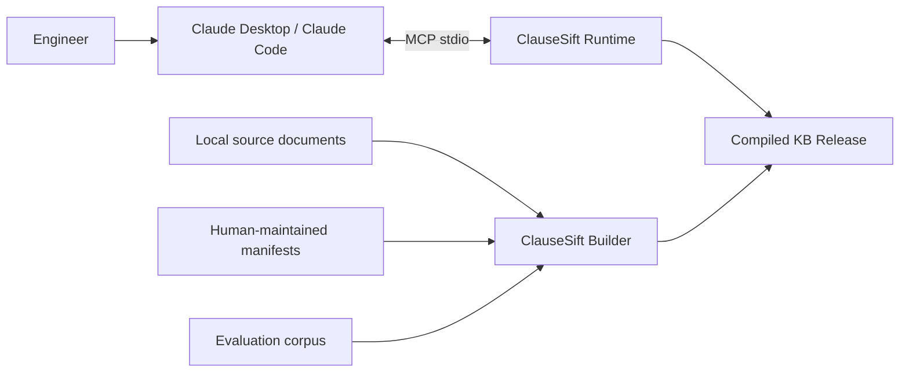
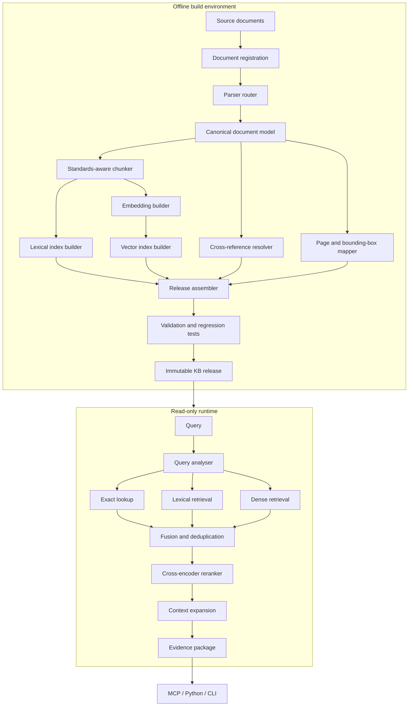

# ClauseSift Design Document

**Document version:** 0.1  
**Status:** Initial design baseline  
**Project:** ClauseSift  
**Repository:** `grammy-jiang/clause-sift`  
**Primary implementation language:** Python  

## 1. Executive summary

ClauseSift is an accuracy-first evidence retrieval engine for engineering standards, codes, design guidelines, technical manuals, and product specifications.

The initial use case is local retrieval across HVAC, ventilation, smoke-control, fire-safety, and manufacturer documentation. The system is intended for a single technical user and a relatively stable document corpus, with most documents changing no more than once per year.

ClauseSift is deliberately not designed as a general-purpose chat platform. Its primary output is a structured evidence package containing the correct document, edition, clause, context, page location, and original text. An AI client such as Claude Desktop or Claude Code may then interpret that evidence through an MCP interface.

The system adopts the following priority order:

1. Accuracy.
2. Query speed.
3. Traceability and reproducibility.
4. Operational simplicity.
5. Build speed.

The central architectural decision is to separate the system into two parts:

- an offline knowledge-base compiler that performs expensive parsing, OCR, structural analysis, chunking, embedding, indexing, validation, and release generation;
- a lightweight, read-only runtime that loads a compiled knowledge-base release and serves evidence through a Python API, CLI, and MCP server.

This design allows ClauseSift to use slow, high-quality processing during infrequent document builds while keeping normal query operations fast and operationally simple.

---

## 2. Problem statement

Engineering design work frequently requires repeated consultation of several document classes:

- mandatory or referenced standards;
- codes and regulations;
- recommended design guidelines;
- technical manuals;
- manufacturer product specifications;
- superseded editions retained for historical projects;
- tables, appendices, figures, notes, exceptions, and cross-references.

General RAG platforms can ingest these documents, but they usually introduce infrastructure and abstractions that are unnecessary for this use case, including multi-user management, persistent task queues, object storage services, chat interfaces, agent orchestration, and online document synchronization.

More importantly, generic RAG systems often treat documents as unstructured text. Engineering standards require stronger guarantees:

- clause numbers must be preserved;
- document editions must not be mixed;
- mandatory requirements must be distinguished from guidance and notes;
- exceptions and parent scope conditions must accompany isolated requirements;
- table headers, units, and row context must survive extraction;
- citations must resolve to an original page and, where possible, a bounding box;
- retrieval must work for exact identifiers, technical terms, numbers, and natural-language questions;
- the system must explicitly report insufficient or conflicting evidence.

ClauseSift addresses this problem as an evidence-retrieval system rather than a PDF-chat application.

---

## 3. Goals

ClauseSift shall:

1. Ingest local engineering standards, codes, guidelines, manuals, and product specifications.
2. Preserve document identity, edition, status, jurisdiction, type, and source hash.
3. Preserve document structure down to clause, subclause, note, exception, table, and appendix level where possible.
4. Support exact identifier lookup, lexical retrieval, semantic retrieval, and reranking.
5. Return original source text with deterministic citations.
6. Expand retrieved evidence with relevant parent scope, exceptions, notes, tables, and cross-references.
7. Support immutable, versioned knowledge-base releases.
8. Allow release validation and rollback.
9. Expose retrieval through a Python library, command-line interface, and MCP server.
10. Operate locally without requiring MySQL, Redis, MinIO, Elasticsearch, or a permanently running vector database.
11. Be distributable as a standard Python installation package.
12. Permit parser, embedding, lexical-index, vector-index, and reranker components to be replaced through stable interfaces.
13. Include a regression-evaluation framework based on real engineering questions and expected evidence.

---

## 4. Non-goals

The first major version will not attempt to provide:

- multi-user authentication or authorization;
- a general-purpose web chat interface;
- enterprise document connectors;
- real-time document synchronization;
- collaborative annotation;
- a generic agent workflow engine;
- long-term conversational memory;
- automatic legal determination of whether a document is enforceable;
- complete HVAC or fire-engineering calculations;
- autonomous approval of engineering designs;
- a universal knowledge graph;
- automatic redistribution of copyrighted standards or specifications.

ClauseSift retrieves and organizes evidence. It does not replace professional engineering judgement or statutory review.

---

## 5. Core design principles

### 5.1 Accuracy before speed

ClauseSift shall not improve latency by silently removing retrieval channels, shrinking candidate pools below validated thresholds, dropping contextual clauses, or replacing original evidence with generated summaries.

Performance optimization begins only after retrieval and citation quality meet defined quality gates.

### 5.2 Original documents remain authoritative

The evidence hierarchy is:

1. original source page;
2. deterministic structured representation;
3. normalized text;
4. generated metadata, summaries, keywords, or query expansions.

Generated content may improve retrieval but must not become the final authority for an engineering conclusion.

### 5.3 Offline compilation, read-only runtime

All document-dependent computation that can be performed once shall be performed during a build:

- parsing and OCR;
- layout analysis;
- clause-tree construction;
- text normalization;
- chunk construction;
- table expansion;
- cross-reference extraction;
- document embeddings;
- lexical indexing;
- vector indexing;
- page rendering and coordinate mapping;
- validation and regression tests.

At query time, the runtime should only:

- analyse the query;
- apply metadata filters;
- compute query embeddings when needed;
- search prebuilt indexes;
- fuse and rerank candidates;
- expand evidence context;
- return structured evidence.

### 5.4 Deterministic rules before LLM inference

The following should be supplied by manifests, parsers, rules, or human review rather than inferred freely by an LLM:

- document identifier;
- edition;
- authority;
- status;
- jurisdiction;
- document type;
- clause number;
- page number;
- file hash;
- supersession relationship;
- citation string.

### 5.5 Immutable knowledge-base releases

A published knowledge-base release is read-only. Updates produce a new release, which is validated before an atomic switch of the active release pointer.

This model supports reproducibility, rollback, and auditability.

### 5.6 Replaceable components

Parsers, embedding models, rerankers, and index engines are implementation choices, not permanent parts of the public data model.

The canonical document model and evidence API must remain stable when individual components change.

### 5.7 Fail visibly

Parser anomalies, unresolved references, low-confidence OCR, conflicting editions, and incomplete applicability conditions must be surfaced as warnings or build failures. They must not be hidden behind a plausible answer.

---

## 6. System context



ClauseSift does not require the AI client to be bundled with the package. The MCP server is an adapter between the client and the evidence-retrieval runtime.

---

## 7. High-level architecture



---

## 8. Package and distribution design

### 8.1 Distribution names

- PyPI distribution: `clausesift`
- Python import package: `clausesift`
- CLI command: `clausesift`
- Repository: `clause-sift`

### 8.2 Installation profiles

The package should use optional dependency groups so that the query runtime does not require heavy parsing and OCR dependencies.

Proposed usage:

```bash
pip install clausesift
pip install "clausesift[build]"
pip install "clausesift[ocr]"
pip install "clausesift[rerank]"
pip install "clausesift[all]"
```

Proposed semantic meaning:

- base: runtime, SQLite catalog, lexical search, exact vector search, CLI, and MCP;
- `build`: standard document parsing and release building;
- `ocr`: heavyweight OCR and difficult-document fallbacks;
- `rerank`: local cross-encoder models;
- `all`: all officially supported optional components.

### 8.3 Runtime/build dependency separation

The runtime package must not import parser or OCR modules during normal startup. Builder-specific code should be loaded only when build commands are invoked.

This prevents a simple MCP runtime from inheriting the memory footprint and installation complexity of the offline pipeline.

---

## 9. Proposed repository layout

```text
clause-sift/
├── docs/
│   ├── design.md
│   ├── canonical-model.md
│   ├── retrieval.md
│   ├── mcp-api.md
│   └── evaluation.md
├── src/
│   └── clausesift/
│       ├── __init__.py
│       ├── cli.py
│       ├── config/
│       ├── model/
│       ├── builder/
│       │   ├── parsers/
│       │   ├── normalisation/
│       │   ├── chunking/
│       │   ├── references/
│       │   ├── lexical/
│       │   ├── embeddings/
│       │   ├── vector/
│       │   ├── reports/
│       │   └── release/
│       ├── runtime/
│       │   ├── catalog/
│       │   ├── query/
│       │   ├── retrieval/
│       │   ├── reranking/
│       │   ├── context/
│       │   └── evidence/
│       ├── mcp/
│       └── evaluation/
├── tests/
│   ├── unit/
│   ├── integration/
│   └── regression/
├── examples/
├── pyproject.toml
├── README.md
├── LICENSE
└── CHANGELOG.md
```

The first implementation may use fewer modules, but public boundaries between builder, runtime, evidence model, and MCP should be preserved.

---

## 10. Source corpus and manifests

### 10.1 Source files

Source documents are stored outside the Python package and are never included in the published wheel or source distribution.

A typical user workspace may contain:

```text
workspace/
├── corpus/
│   ├── inbox/
│   ├── originals/
│   └── manifests/
├── cache/
├── releases/
└── current
```

### 10.2 Copyright boundary

ClauseSift distributes software only. It must not bundle proprietary standards, manufacturer documents, or user corpora.

Users are responsible for possessing and using source documents lawfully.

### 10.3 Document manifest

Each document should have a human-reviewed manifest.

Example:

```yaml
manifest_schema_version: "1"
document_id: as-1668-1-2015
title: AS 1668.1:2015
document_code: AS 1668.1
edition: "2015"
authority: Standards Australia
document_type: mandatory_standard
release_tier: critical
jurisdictions:
  - Australia
disciplines:
  - hvac
  - smoke_control
  - fire_safety
status: active
effective_from: null
supersedes: null
superseded_by: null
reference_edition_overrides: {}
language: en
source_file: corpus/originals/AS1668.1-2015.pdf
sha256: "sha256:0123456789abcdef0123456789abcdef0123456789abcdef0123456789abcdef"
```

Registration computes `manifest_bytes_hash` over the exact manifest file bytes before decoding, then loads the YAML with a safe loader that rejects custom tags and validates it against a versioned schema with unknown fields rejected. It separately computes `manifest_content_hash` over the schema-normalized canonical representation. SHA-256 values use the canonical string form `sha256:` followed by exactly 64 lowercase hexadecimal characters; bare digests, uppercase characters, and surrounding whitespace are invalid. The non-zero value above is illustrative and registration must replace it with the digest calculated from the selected source bytes before human approval. `sha256` is mandatory and non-null for any manifest admitted to a build.

The immutable approval record stores both manifest hashes. Before ingestion, the builder recomputes the raw-byte hash and requires exact equality with the approved `manifest_bytes_hash`, then safe-loads and canonicalizes the manifest and requires equality with the approved `manifest_content_hash`. Any byte change, including comments, whitespace, encoding, or key order that preserves canonical content, invalidates the approval and requires human re-review; changing either approved hash invalidates the affected build and release-assembly cache entries.

`release_tier` is either `critical` or `standard`. A critical document is one whose omission or structurally incorrect parsing can invalidate a release; it is subject to the dual-parser and release-blocking rules in Section 11.3.

### 10.4 Initial document types

- `mandatory_standard`
- `referenced_standard`
- `code_or_regulation`
- `design_guideline`
- `technical_manual`
- `manufacturer_specification`
- `research_reference`
- `superseded_document`

Document type is part of evidence and affects how an AI client should describe the source.

---

## 11. Parser architecture

### 11.1 Parser router

No parser is assumed to be best for every document.

The parser router chooses a path according to document characteristics and user configuration.

Initial candidate paths:

- Docling for structured standards and ordinary technical PDFs;
- PyMuPDF-based extraction for deterministic page text and coordinate comparison;
- MinerU or another OCR pipeline for scanned or difficult documents;
- dual-parser comparison for critical documents.

No parser selection becomes permanent until it is measured against the project evaluation corpus.

Source documents and parser outputs are untrusted. Parser adapters should run in isolated subprocesses with no network access, a dedicated temporary directory, explicit CPU, memory, wall-time, file-size, and page-count limits, and read-only access only to the selected source file plus the pinned parser executable, runtime libraries, and declared local model assets required for that adapter. They receive no read access to the remaining corpus, workspace, credentials, or operator state. The builder validates the adapter's parser-neutral output before importing it; a timeout, limit violation, crash, or malformed output fails that document rather than weakening isolation.

### 11.2 Parser contract

Every parser adapter must produce a parser-neutral intermediate representation containing, where available:

- pages and page dimensions;
- blocks and reading order;
- headings and hierarchy;
- paragraphs and lists;
- tables and cells;
- figures and captions;
- footnotes;
- source page numbers;
- bounding boxes;
- original extracted text;
- OCR status and confidence;
- parser warnings.

### 11.3 Parser validation

The builder must test:

- source and parsed page counts;
- missing-text ratios;
- abnormal-character ratios;
- heading-tree consistency;
- clause-number continuity;
- duplicated header/footer text;
- cross-page paragraph continuity;
- table shape consistency;
- unresolved page coordinates;
- differences between two parser outputs when comparison mode is enabled.

Comparison mode is mandatory for every `critical` document and optional for a `standard` document. A critical document must be parsed independently by two configured adapters backed by distinct parser implementations; running one implementation twice or changing only its options does not satisfy this rule. Neither adapter's output becomes canonical until the comparison gate passes.

For a critical document, any of the following is a blocking disagreement: either adapter fails; parsed page counts differ from the source or each other; a normative clause, exception, table, or page mapping appears in only one output; clause identities or ordering differ; a table's dimensions, headers, units, or cell values differ; or any versioned comparison metric exceeds its configured threshold. The static review report must show both outputs and every disagreement. A blocked document may proceed only after correcting the parser, source, or manifest and rerunning the build; v0.1 has no waiver that selects one output while a blocking disagreement remains.

The versioned parser-routing configuration must name an ordered `canonical_primary` and `independent_comparator` for every critical document, either directly or through a deterministic rule over manifested fields. Both adapter identities, versions, configurations, and assigned roles are build inputs. After both single-parser gates and the comparison gate pass, the builder selects the `canonical_primary` parser-neutral artifact byte-for-byte as the sole input to deterministic canonical-model construction; the comparator is validation-only. Below-threshold wording or OCR differences therefore resolve to the primary output, never to field-by-field merging, majority selection, or build-order choice. Changing either role invalidates the parse and all downstream cache entries and requires a complete rebuild and review. With unchanged source bytes, ordered roles, adapters, and configurations, both the selected parser artifact and resulting canonical model must be byte-identical across rebuilds.

A critical document that fails either single-parser quality thresholds or the dual-parser comparison gate must not enter a production release.

---

## 12. Canonical document model

The canonical document model isolates the rest of ClauseSift from parser-specific output formats.

### 12.1 Core node fields

```text
node_id
document_id
node_type
parent_node_id
previous_node_id
next_node_id
heading
heading_path
clause_number
page_start
page_end
bounding_boxes
original_text
normalized_text
parser_source
parser_confidence
attributes
```

A non-null `clause_number` declares that the node is independently addressable by exact clause lookup. It must contain the canonical normalized, non-empty identifier for that document; descendants that are not independently addressable keep it null rather than copying an ancestor's number for display. The catalog constraints in Section 14.1 make every non-null `(document_id, clause_number)` unique, so exact lookup cannot select between two canonical subtrees.

### 12.2 Initial node types

- `document`
- `part`
- `chapter`
- `section`
- `clause`
- `subclause`
- `paragraph`
- `requirement`
- `definition`
- `exception`
- `note`
- `table`
- `table_row`
- `figure`
- `caption`
- `appendix`
- `footnote`

### 12.3 Text variants

Each searchable unit may include:

- `original_text`: source-faithful text returned as evidence;
- `normalized_text`: repaired line breaks, hyphenation, and whitespace;
- `search_text`: normalized text plus deterministic document and hierarchy context;
- `embedding_text`: text formatted for the selected embedding model.

Search-enriched text must not replace original evidence text.

---

## 13. Standards-aware chunking

### 13.1 Chunk boundaries

Preferred boundaries are:

1. complete clause or subclause;
2. complete requirement plus its directly attached exception or note metadata;
3. complete table or logically independent table row;
4. semantically complete paragraph;
5. token-limit split as a last resort.

Fixed-size character chunking is not the primary strategy.

### 13.2 Chunk fields

```text
chunk_id
document_id
node_ids
chunk_kind
canonical_order
clause_number
heading_path
node_type
page_start
page_end
parent_chunk_id
previous_chunk_id
next_chunk_id
original_text
search_text
embedding_text
```

`document_id` is the immutable identity of one manifested edition. `edition` remains the human-readable version label in the document record; chunks do not introduce a second `document_version` concept.

Every persisted chunk has non-empty source-faithful `original_text`. Chunk membership records the ordered, half-open UTF-8 byte span contributed by each member node; offsets must fall on code-point boundaries. Full-node membership uses the entire encoded `nodes.original_text`. The versioned chunk projection joins those spans with its declared source-faithful separator, while hierarchy and retrieval enrichment appear only in `search_text` or `embedding_text`.

`chunk_kind` is a closed, versioned enum covering every representation emitted by the chunker, and the chunker configuration assigns every kind a unique rank. The builder deduplicates the exact representation key `(chunk_kind, ordered (node_id, node_text_start, node_text_end) memberships)`, sorts each document's remaining chunks by `(first member node canonical order, first member byte start, chunk-kind rank, last member node canonical order, last member byte end, SHA-256 of the ordered membership tuples, chunk_id)`, and persists a dense zero-based `canonical_order`. The final `chunk_id` tie-breaker is itself deterministically derived from the unchanged chunk inputs. Release validation recomputes the representation keys and ordering and rejects a duplicate representation, gap, duplicate position, unknown kind, or mismatch; runtimes order evidence by persisted `canonical_order` ascending.

### 13.3 Context integrity

The chunker must preserve or link:

- scope conditions inherited from parent clauses;
- exceptions;
- notes and their informative status;
- table titles, headers, and units;
- normative versus informative appendices;
- source pages and bounding boxes;
- previous and next logical units.

### 13.4 Tables

Tables should create at least two searchable representations:

1. a whole-table representation;
2. row-level representations that repeat table title, headers, units, and parent clause context.

Table extraction confidence should be carried into evidence warnings.

---

## 14. Catalog and storage

### 14.1 SQLite as the authoritative catalog

SQLite should store:

- document manifests;
- versions and status;
- canonical nodes;
- chunks and text variants;
- page and bounding-box mappings;
- cross-references;
- build metadata;
- parser warnings;
- release metadata;
- evaluation results.

SQLite is the source of truth for structured knowledge-base metadata.

Primary keys, foreign keys, `NOT NULL` constraints, and uniqueness constraints must encode the canonical invariants rather than relying only on application code. The initial schema requires at least:

`node_id`, `chunk_id`, `source_id`, and `cross_reference_id` are globally unique within a catalog release and remain stable across deterministic rebuilds of unchanged inputs. The apparently redundant unique pairs `(document_id, node_id)` and `(document_id, chunk_id)` are ownership candidate keys: dependent tables and self-relations reference those pairs so SQLite proves that an otherwise global node or chunk ID belongs to the accompanying document.

| Table | Required constraints |
| --- | --- |
| `documents` | `document_id` primary key; `document_code`, `edition`, `manifest_bytes_hash`, `manifest_content_hash`, `source_file_hash`, and positive `source_page_count` `NOT NULL`; unique `(document_code, edition)`. |
| `nodes` | Globally unique `node_id` primary key; `document_id`, `node_type`, `original_text`, and canonical order `NOT NULL`; `document_id` foreign key to `documents`; unique ownership key `(document_id, node_id)` and unique `(document_id, canonical_order)`. `clause_number` is either null or a normalized non-empty exact-lookup key, with a unique partial key `(document_id, clause_number) WHERE clause_number IS NOT NULL`. `parent_node_id`, `previous_node_id`, and `next_node_id` are nullable only for the sole document root or sequence boundaries, may not equal `node_id`, and each non-null relation uses composite foreign key `(document_id, related_node_id)` to `nodes(document_id, node_id)` with `ON DELETE RESTRICT`. |
| `chunks` | Globally unique `chunk_id` primary key; `document_id`, closed-enum `chunk_kind`, dense zero-based `canonical_order`, non-empty `original_text`, `search_text`, and `embedding_text` `NOT NULL`; `document_id` foreign key to `documents`; unique ownership key `(document_id, chunk_id)` and unique `(document_id, canonical_order)`. `parent_chunk_id`, `previous_chunk_id`, and `next_chunk_id` are nullable only where the structural relation or sequence neighbor does not exist; each non-null relation uses composite foreign key `(document_id, related_chunk_id)` to `chunks(document_id, chunk_id)` with `ON DELETE RESTRICT`. |
| `chunk_nodes` | `document_id`, `chunk_id`, `node_id`, `member_order`, `node_text_start`, and `node_text_end` `NOT NULL`; composite primary key `(chunk_id, node_id)` and unique `(chunk_id, member_order)`; checks require zero-based `member_order`, `node_text_start >= 0`, and `node_text_end > node_text_start`; composite foreign keys `(document_id, chunk_id)` to `chunks(document_id, chunk_id)` and `(document_id, node_id)` to `nodes(document_id, node_id)` with `ON DELETE RESTRICT`. |
| `node_page_spans` | `document_id`, `node_id`, half-open UTF-8 byte `node_text_start`, `node_text_end`, `page_number`, and `mapping_order` `NOT NULL`; primary key `(node_id, node_text_start, node_text_end, page_number)` and unique `(node_id, mapping_order)`; composite foreign key `(document_id, node_id)` to `nodes(document_id, node_id)` with `ON DELETE RESTRICT`; checks require valid non-empty byte spans, non-negative mapping order, positive pages, and schema-valid optional bounding boxes. |
| `document_jurisdictions` and `document_disciplines` | Both columns `NOT NULL`; `document_id` foreign key to `documents`; composite primary key `(document_id, jurisdiction)` or `(document_id, discipline)`. |
| `sources` | Globally unique `source_id` primary key; `document_id`, `chunk_id`, and page span `NOT NULL`; `document_id` foreign key to `documents`; composite foreign key `(document_id, chunk_id)` to `chunks(document_id, chunk_id)` with `ON DELETE RESTRICT`; unique `(document_id, chunk_id)`; page span check enforces positive ordered pages. |
| `cross_references` | Globally unique `cross_reference_id` primary key; source node and document IDs, relation type, raw text, normalized parsed target fields, and resolution status `NOT NULL` where the reference grammar supplies them; composite foreign key `(source_document_id, source_node_id)` to `nodes(document_id, node_id)`. A `resolved` row requires both target IDs and composite foreign key `(target_document_id, target_node_id)` to `nodes(document_id, node_id)`; every unresolved row requires both target IDs to be null. All ownership foreign keys use `ON DELETE RESTRICT`. Source and resolved-target document code, edition, and clause are read-only join projections rather than independently writable base columns. |

Before any subtree or context query runs, release validation proves that every document's node parent relation is one rooted tree. Each document has exactly one null-parent node of type `document`; every other node has exactly one parent in that document whose canonical order is lower than the child's. A recursive traversal seeded at that root must visit every document node exactly once, and explicit path tracking must report a self-edge, repeated node, disconnected component, or parent cycle. The same gate requires previous/next node links to be reciprocal and to name the immediate canonical-order neighbor or null at the corresponding boundary. A violation blocks index assembly and activation, so runtime traversal never relies on a recursion-depth limit to contain malformed structure. Chunk parent edges must likewise point to a lower chunk `canonical_order`; chunk previous/next links must be reciprocal immediate-order neighbors, which makes the optional chunk hierarchy acyclic and its sequence deterministic.

Release validation enforces a total one-to-one mapping between chunks and sources: every chunk admitted to the release has exactly one source row, and every source row names that chunk's document. The unique key rejects duplicate mappings and the ownership foreign key rejects orphan or cross-document sources; an anti-join for chunks without a source is a blocking catalog invariant before index assembly or activation. The runtime opens only a catalog that passed this check.

Release validation reconstructs each chunk's `original_text` by sorting its `chunk_nodes` rows by the gap-free `member_order`, checking that every half-open byte span is within the referenced non-null `nodes.original_text` and starts and ends on UTF-8 code-point boundaries, extracting those spans, and joining them with the versioned projection separator. Null or empty chunk text, an invalid membership span, missing or duplicate order positions, and any byte mismatch between the reconstruction and stored `chunks.original_text` block index assembly and activation.

Release validation also derives source provenance rather than trusting stored page numbers. Every byte in each `chunk_nodes` member span must be covered without a gap by that node's gap-free ordered `node_page_spans`; every mapping page must be within `1..documents.source_page_count`. For each chunk, the validator computes the minimum and maximum intersecting page numbers and requires its sole `sources` row to store exactly those values. Evidence bounding boxes are projected only from the intersecting mappings, in page and mapping order, and must lie on pages within that derived span. A missing mapping, an out-of-range page or box, or any stored-versus-derived source span mismatch blocks index assembly and activation.

Release validation also enforces exact-key determinism and byte-complete subtree coverage. Every non-null clause number must already be in canonical normalized form, and the partial unique key rejects two addressable nodes with the same `(document_id, clause_number)`. For this check, a retrievable node has non-empty source-faithful `original_text`, including any serialized table-cell text; an empty page-only structural anchor is contextual rather than a retrievable chunk member. For each addressable clause, its covering set is every distinct chunk with a `chunk_nodes` membership on a retrievable node in that clause's subtree, and the set must be non-empty. For every retrievable subtree node, the validator sorts and merges all member intervals contributed by that covering set and requires their union to equal exactly the full half-open UTF-8 byte interval `[0, byte_length(nodes.original_text))`; overlaps from whole-table and row representations are allowed, but a missing prefix, interior gap, or missing suffix blocks release. An addressable structural root whose own `original_text` is empty needs no zero-length direct membership, even if it carries a contextual page mapping: byte-complete descendant coverage satisfies the clause. An addressable subtree with no retrievable self or descendant content remains invalid. A recursive coverage query reports the clause, node, and every uncovered byte interval; any duplicate normalized key, empty covering set, contentless addressable subtree, or byte-incomplete retrievable descendant is a blocking catalog invariant before index assembly or activation. Together with chunk-to-source totality and chunk-text reconstruction, this guarantees that an existing clause resolves one subtree and can always produce the non-empty, complete, source-faithful `get_clause` result required by Section 22.

Jurisdictions, disciplines, chunk-node membership, and other multivalued query fields use normalized link tables, not delimiter-encoded strings.

All runtime SQL, including FTS5 predicates, must use bound parameters. A dedicated query compiler escapes or rejects FTS5 operators according to the selected search mode; raw client text is never accepted as an FTS expression. Identifiers from MCP or CLI input are catalog keys, never SQL fragments or path components.

### 14.2 Rebuildable indexes

Lexical and vector indexes are derived artifacts. They must be reconstructable from the canonical model and catalog.

The catalog must provide indexes for exact `(document_id, clause_number)` lookup; unique document code plus edition; `(status, document_type, document_id)` filtering; `(jurisdiction, document_id)` and `(discipline, document_id)` link-table filtering; source IDs; chunk-node membership in both directions; and cross-reference source and target keys. Query-plan regression tests must demonstrate index use for exact clause lookup and jurisdiction, discipline, status, and document-type filters. `chunks.jsonl`, when emitted, is a checksummed audit/export projection derived from SQLite; the runtime does not treat it as a second source of truth.

### 14.3 Original files

Original files remain in the user workspace. The catalog stores paths and hashes but does not replace the original source.

Runtime telemetry is not part of the immutable catalog. If enabled, it is written to a separately configured state directory outside the active release, with query text disabled by default as specified in Section 33.

---

## 15. Lexical retrieval

Lexical retrieval is mandatory because engineering queries frequently contain exact tokens that dense models can blur:

- document codes;
- clause identifiers;
- table numbers;
- product model numbers;
- numbers and units;
- abbreviations;
- exact phrases.

Candidate engines include:

- Tantivy bindings;
- BM25S;
- SQLite FTS5.

The initial implementation will select an engine after benchmarking:

- English and Chinese retrieval;
- punctuation and unit tokenisation;
- field weighting;
- index size;
- load time;
- reproducibility;
- Python packaging complexity.

The public retrieval interface must not depend on a specific lexical engine.

---

## 16. Dense retrieval

### 16.1 Offline document embeddings

All document and chunk embeddings are generated during a build and stored in the release.

Changing the embedding model or revision invalidates the affected vector artifacts.

### 16.2 Runtime query embeddings

Only the current query is embedded at runtime.

The query model may be loaded lazily when semantic retrieval is first requested.

### 16.3 Exact search first

For small and medium local corpora, ClauseSift should prefer exact cosine or dot-product search over approximate nearest-neighbour search.

A normalized vector matrix may be memory-mapped and searched as:

```python
scores = embeddings @ query_vector
```

Approximate indexing should be introduced only when measured latency justifies it and recall loss has been quantified.

### 16.4 Candidate scale guidance

These are starting hypotheses, not hard limits:

- under approximately 50,000 chunks: NumPy memory-mapped exact search;
- approximately 50,000 to 300,000 chunks: NumPy or FAISS exact search;
- larger corpora or validated latency constraints: evaluate ANN indexes.

Actual thresholds must be determined on target hardware.

### 16.5 Embedding model selection

Embedding models must be benchmarked on the project corpus, including:

- English standards;
- Chinese standards;
- cross-language queries;
- HVAC and fire-safety terminology;
- identifiers and product models;
- numbers and units;
- synonyms;
- negation and exception queries.

No embedding model is considered permanent without evaluation evidence.

---

## 17. Query analysis and retrieval modes

### 17.1 Query analysis

Deterministic analysis should detect:

- document codes;
- clause numbers;
- editions;
- product model numbers;
- numbers and units;
- document types;
- jurisdiction and discipline filters;
- version-comparison intent;
- source-page requests.

### 17.2 Retrieval modes

#### Exact mode

For explicit document, clause, model, or numeric queries:

```text
metadata filtering
+ exact identifier lookup
+ lexical retrieval
```

No embedding or reranker is required unless exact retrieval is ambiguous.

#### Hybrid mode

For natural-language questions:

```text
lexical retrieval
+ dense retrieval
+ rank fusion
```

#### High-accuracy mode

For complex, cross-document, or applicability-sensitive questions:

```text
exact lookup
+ lexical retrieval
+ dense retrieval
+ fusion
+ cross-encoder reranking
+ context expansion
```

The public mode enum is `auto`, `exact`, `hybrid`, and `high_accuracy`. The runtime may select a mode automatically, but the API must allow an explicit mode override. `auto` selects only among capabilities present in both the installed runtime and the active release. If dense retrieval or reranking is unavailable, `auto` returns the best available result with a typed `retrieval_capability_unavailable` warning; an explicit unavailable mode fails with `feature_unavailable` rather than silently degrading.

---

## 18. Candidate fusion and reranking

A starting high-accuracy pipeline is:

```text
exact identifier matches
lexical top 30-50
dense top 30-50
        ↓
deduplication and reciprocal-rank fusion
        ↓
cross-encoder reranking of top 20-30
        ↓
final evidence candidates: top 8-12
```

These numbers are initial parameters. They must be adjusted through Recall@K and end-to-end evaluation rather than latency preference alone.

The reranker may be loaded lazily. High-value engineering queries should retain the option to invoke it even when it increases latency. Lazy-load timeout and cold-versus-warm behavior are defined once in Section 27; Section 30 defines how those states are measured.

---

## 19. Context expansion

A relevant sentence is not necessarily sufficient evidence.

After retrieval, ClauseSift should inspect document structure and attach required context, including:

- parent scope clauses;
- definitions;
- exceptions;
- notes;
- referenced tables;
- linked clauses;
- normative appendices;
- previous or next logical units where required.

Context expansion is structure-driven rather than a fixed previous/next chunk window.

Example rule:

```text
retrieved requirement
    → include clause heading
    → inspect parent applicability condition
    → include sibling exception
    → include referenced table
    → resolve directly referenced clause
```

---

## 20. Cross-reference model

The build pipeline should detect deterministic references such as:

- `refer to Clause 4.2`;
- `subject to Section 5`;
- `except as permitted by Table 3.1`;
- `in accordance with AS/NZS 1668.2`.

Proposed fields:

```text
cross_reference_id
source_node_id
source_document_id
source_edition
target_document_code
target_edition
target_clause
target_document_id
target_node_id
relation_type
resolution_status
raw_reference_text
```

The persisted extraction fields are `parsed_target_document_code`, `parsed_target_edition`, and `parsed_target_clause`; each is null only when the reference grammar omits that component and otherwise contains its canonical normalized value. The similarly named `target_document_code`, `target_edition`, and `target_clause` values exposed to reports or runtime clients are derived by joining `target_document_id` to `documents` and `target_node_id` to `nodes`; callers and builders cannot write those projections independently.

`source_document_id` and `source_edition` are always populated from the source node. A resolved reference must store the release-scoped `target_document_id`, `target_edition`, and `target_node_id`; document code plus clause text alone is not a stable join key. Resolution is deterministic:

1. a same-document reference uses the source `document_id`;
2. an external reference naming a document code and edition requires exactly one catalogue match for that pair;
3. an unqualified external document code uses the source manifest's human-reviewed `reference_edition_overrides` mapping when present, and the mapped `document_id` must exist in the release and match that code;
4. without an override, an unqualified external code resolves only when exactly one release document has that code.

Multiple eligible documents produce `ambiguous_edition`; no eligible document produces `unresolved_document`; and an eligible document without the referenced clause produces `unresolved_clause`. None of these conditions may silently select the newest or active edition. The manifest schema defines `reference_edition_overrides` as a mapping from normalized external document code to an immutable target `document_id`; it is covered by manifest approval and release validation.

The initial `resolution_status` enum is `resolved`, `unresolved_document`, `ambiguous_edition`, and `unresolved_clause`. Same-document references inherit the source `document_id`. `resolved` requires both target IDs. When `parsed_target_clause` is present, the target must be the unique addressable node in the resolved document whose normalized `clause_number` equals it; when the grammar names only a document, the target node must be that document's sole root. Release validation reruns the deterministic four-step resolver from the immutable parsed fields, approved overrides, and candidate release catalog and requires the stored `resolution_status`, `target_document_id`, and `target_node_id` to equal its result exactly. It also requires every non-null parsed document code and edition to equal the selected joined document values. An existing but different node, a writable code/edition projection, or IDs attached to an unresolved result blocks index assembly and activation.

Release policy is tier-specific and has no count threshold in v0.1:

- for a `critical` document, every extracted cross-reference row must be `resolved`; any `unresolved_document`, `ambiguous_edition`, or `unresolved_clause` status emits a blocking `cross_reference_unresolved`, fails release validation, and requires a manifest correction, parser/resolver correction, or re-approved change of release tier before rebuilding;
- for a `standard` document, a non-resolved status emits an advisory `cross_reference_unresolved` and may ship only when the static review report enumerates it and the unresolved row exposes no navigable target IDs.

The release summary records unresolved counts by document, tier, status, and relation type. Runtime context expansion never follows an unresolved row.

Human-reviewed manifest fields are authoritative for `supersedes` and `superseded_by`. An extracted supersession statement is stored as evidence and proposed metadata, but it does not overwrite the manifest. Any disagreement emits `edition_conflict` and blocks a critical document until reviewed.

Initial relation types:

- `references`
- `depends_on`
- `exception_to`
- `defines`
- `supersedes`
- `amends`
- `applies_subject_to`

The first release will use relational cross-reference data, not a generic graph database.

---

## 21. Evidence package

ClauseSift returns structured evidence, not only prose.

Example:

```json
{
  "query": "When may mechanical smoke exhaust be omitted?",
  "retrieval_mode": "high_accuracy",
  "release": "2026.08",
  "evidence": [
    {
      "source_id": "src-001",
      "document_id": "as-1668-1-2015",
      "document_code": "AS 1668.1",
      "edition": "2015",
      "document_type": "mandatory_standard",
      "status": "active",
      "clause": "4.6.2",
      "heading_path": [
        "Smoke-control systems",
        "Fan operation"
      ],
      "node_type": "requirement",
      "content_trust": "untrusted_source",
      "page_start": 47,
      "page_end": 47,
      "original_text": "...",
      "citation": "[AS 1668.1:2015, cl. 4.6.2, p.47]",
      "bounding_boxes": [],
      "retrieval_channels": [
        "lexical",
        "dense"
      ],
      "rerank_score": 0.91,
      "source_file_hash": "sha256:...",
      "warnings": []
    }
  ],
  "warnings": [
    {
      "code": "applicability_incomplete",
      "phase": "runtime",
      "severity": "advisory",
      "message": "Applicability depends on building classification.",
      "source_id": "src-001"
    }
  ]
}
```

Citation fields are generated programmatically. The AI client must not invent or repair missing citations.

Every warning is an object with a Section 31 `code`, `phase`, `severity`, a human-readable `message`, and optional `source_id` and structured `details`; bare warning strings are invalid. `original_text` and other document-derived fields are untrusted quoted evidence, not instructions to the MCP host or model. Evidence items carry `content_trust: "untrusted_source"`, and tool descriptions instruct clients to preserve that boundary.

---

## 22. MCP interface

The first runtime uses the official Python MCP SDK and local `stdio` transport. ClauseSift v0.1 targets MCP revision `2026-07-28` through the SDK's dual-era server support and must also pass compatibility tests with `2025-11-25` clients. The exact SDK version is pinned and recorded in `build-info.json`; upgrading either protocol behavior or the SDK requires conformance and client-compatibility tests.

The v0.1 server advertises only the tools and resources it implements. Its tool and resource lists are stable for the lifetime of the process, so it does not advertise list-change notifications or resource subscriptions. A release-pointer change becomes visible after a server restart, not through an in-session mutable resource catalogue.

### 22.1 Initial tools

#### `search_evidence`

Search the active release and return ranked, citation-ready evidence with applicability context and typed warnings.

```python
search_evidence(
    query: str,
    document_codes: list[str] | None = None,
    document_types: list[str] | None = None,
    editions: list[str] | None = None,
    jurisdictions: list[str] | None = None,
    disciplines: list[str] | None = None,
    status: str | None = "active",
    mode: str = "auto",
    limit: int = 10,
)
```

The input schema constrains `mode` to the Section 17 enum and `limit` to the inclusive range 1-100.

#### `get_clause`

Resolve one cataloged document edition and clause number exactly; do not substitute another edition.

```python
get_clause(
    document_id: str,
    clause_number: str,
)
```

The lookup resolves one canonical clause node, then returns every distinct persisted chunk whose `chunk_nodes` membership is required to cover that clause's retrievable canonical subtree. It returns one evidence item only when one chunk provides the complete coverage; otherwise it returns one item per covering chunk in ascending canonical chunk order, regardless of whether the boundaries came from independently chunked subclauses, whole-table and row representations, semantic paragraphs, or a token-limit split. Each item retains its own `source_id`, page span, bounding boxes, and source-faithful `original_text`; the handler must not aggregate several chunks under one source ID or omit any covering chunk.

#### `get_context`

Expand a previously returned source ID with its parent conditions, exceptions, notes, tables, and direct references.

```python
get_context(
    source_id: str,
    include_parent: bool = True,
    include_exceptions: bool = True,
    include_notes: bool = True,
    include_tables: bool = True,
    include_references: bool = True,
)
```

The success object always contains all five context arrays: `parents`, `exceptions`, `notes`, `tables`, and `references`. A false include flag performs no traversal for that relation class and requires the corresponding array to be empty; a true flag may also produce an empty array when no matching relation exists. The strict output schema requires all five properties and does not vary its shape with the flags.

#### `get_document_metadata`

Return the human-reviewed manifest and release identity for one cataloged document edition.

```python
get_document_metadata(document_id: str)
```

#### `list_documents`

List document metadata in stable `(document_code, edition, document_id)` order with opaque cursor pagination.

```python
list_documents(
    document_type: str | None = None,
    status: str | None = None,
    discipline: str | None = None,
    cursor: str | None = None,
    limit: int = 50,
)
```

The input schema constrains `limit` to 1-100. The result contains `items` and `next_cursor`; `next_cursor` is null on the final page. Cursors are opaque, release-bound, and rejected after a release change.

#### `get_page_reference`

Return deterministic page metadata and an authorized reference to the original page for one cataloged document.

```python
get_page_reference(
    document_id: str,
    page_number: int,
)
```

Every tool declares a human-readable description, JSON Schema input and output contracts, and a read-only annotation. Every input-schema property has a non-empty description covering its identifier domain or units, normalization, default and null behavior, list-combination behavior where applicable, and bounds. Evidence-shaped successes are returned in `structuredContent` conforming to the output schema, with the same JSON serialized into a text content block for legacy clients. All output schemas use `additionalProperties: false`.

Every handler returns an internal typed result to one central outbound serializer; that serializer constructs each public result from an explicit per-type field allowlist and fails closed on an unknown field. Diagnostics use code-owned message templates and per-code allowlists for detail keys and value types; raw exception strings, `repr` output, and arbitrary caller-supplied diagnostic messages are never serialized. The legacy text block is generated only from the already validated public object, not through a second formatting path. Raw source paths and internal workspace layout are not allowlisted and therefore cannot appear in either representation. Security regression tests inject an internal path as an extra field and inside otherwise allowed `message` and `details` values, and require both structured and legacy serialization to reject or safely redact it without emitting the sentinel.

The following semantic contract is normative; the JSON Schemas must encode it directly rather than replacing it with unconstrained objects.

| Tool | Selection semantics | Success result | Domain-error cases |
| --- | --- | --- | --- |
| `search_evidence` | Trimmed non-empty query; values are ORed within each supplied filter list and filter categories are ANDed; `status: null` removes the default active-status filter; `mode` resolves under Section 17. | `{query, retrieval_mode, release, evidence, warnings}` where `evidence` is an ordered array of Section 21 evidence items and `warnings` is an array of typed warning objects. | `identifier_invalid` for malformed filters; `feature_unavailable` for an explicit unsupported mode or bounded load failure; `release_integrity_failed` when a lazy model asset fails its pre-load integrity check. No matches is a success, not an error. |
| `get_clause` | Exact opaque `document_id` plus normalized exact `clause_number`; no fuzzy clause or edition substitution. Resolve the canonical clause node and select every distinct persisted chunk needed to cover its retrievable subtree, independent of chunk-boundary cause. | `{release, evidence, warnings}` with a non-empty, canonically ordered array of Section 21 evidence items, one per covering chunk. Every item retains its own `source_id` and source span. | `identifier_invalid` for malformed input; `resource_not_found` when the document or clause is absent. |
| `get_context` | Exact `source_id`; each boolean independently controls traversal of that relation class. False performs no traversal and yields an empty array for the class. | `{release, source_id, context, warnings}` where `context` always has required arrays `parents`, `exceptions`, `notes`, `tables`, and `references`, each containing catalog-bound evidence or relation records when requested and found. | `identifier_invalid` for malformed input; `resource_not_found` for an unknown source. |
| `get_document_metadata` | Exact opaque `document_id`; no active-edition fallback. | `{release, document}` where `document` contains the safe manifest projection, source hash, review status, and release identity, but no absolute path. | `identifier_invalid` for malformed input; `resource_not_found` for an unknown document. |
| `list_documents` | Non-null filters are ANDed; each filter value is an exact normalized enum or discipline key; ordering and cursor rules are those stated above. | `{release, items, next_cursor}` where every item is the same safe document-metadata summary and `next_cursor` is string or null. | `identifier_invalid` for a malformed filter, limit, or cursor; `resource_not_found` for a cursor bound to another release. |
| `get_page_reference` | Exact opaque `document_id` and one-based integer page number within the manifested source. | `{release, document_id, page_number, page_label, page_uri, content_hash}` where `page_uri` is an authorized `standards://page/...` resource URI, never a filesystem path. | `identifier_invalid` for malformed or out-of-range input; `resource_not_found` for an unknown document or unavailable page. |

Client-supplied `document_id`, `source_id`, cursor, and page or clause identifiers are opaque catalog keys. A handler first resolves them through a parameterized catalog query. It must never interpolate them into SQL, concatenate them into a filesystem path, or decode a cursor into a path. Any catalog-derived path is resolved against an allowlisted release or originals root, then rejected unless it is a regular file beneath that root after normalization and symlink, junction, or reparse-point resolution.

### 22.2 Future tools

- `compare_document_versions`
- `resolve_cross_reference`
- `search_tables`
- `search_product_specifications`
- `get_product_parameter`
- `validate_citation`

### 22.3 MCP resources

Proposed resource URIs:

```text
standards://document/{document_id}
standards://clause/{document_id}/{clause_number}
standards://source/{source_id}
standards://page/{document_id}/{page_number}
standards://release/current
```

Resource URI variables follow the same catalog-first resolution rule as tool inputs.

| URI | MCP kind | v0.1 capability |
| --- | --- | --- |
| `standards://document/{document_id}` | Resource template | Read-only; no subscribe; no list-change notification. |
| `standards://clause/{document_id}/{clause_number}` | Resource template | Read-only; no subscribe; no list-change notification. |
| `standards://source/{source_id}` | Resource template | Read-only; no subscribe; no list-change notification. |
| `standards://page/{document_id}/{page_number}` | Resource template | Read-only; no subscribe; no list-change notification. |
| `standards://release/current` | Static resource | Read-only snapshot for the process lifetime; no subscribe; no list-change notification. |

The v0.1 resource catalogue is immutable for one server process. The server does not advertise resource subscription or list-change capabilities.

### 22.4 Errors and protocol behavior

- Unknown methods or tools, malformed JSON-RPC, and requests that do not satisfy the MCP request schema are protocol-level JSON-RPC errors.
- A well-formed tool call that fails semantic validation or execution returns a tool result with `isError: true` and a typed error code, for example `identifier_invalid`, `resource_not_found`, or `feature_unavailable`.
- A valid search with no matching evidence is a successful result with an empty `evidence` array and an `evidence_insufficient` warning. It is not a protocol error.
- An unknown, well-formed `standards://` resource is never represented as a tool result or an empty `contents` success. `resources/read` returns JSON-RPC `-32602` on the per-request `2026-07-28` path and `-32002` on a `2025-11-25` session. This protocol error is distinct from the ClauseSift `resource_not_found` diagnostic used by tool calls.
- When a known page resource's external original fails the on-demand containment, size, or hash check, `resources/read` returns JSON-RPC internal error `-32603` on both protocol paths with the code-owned message `Source integrity check failed` and safe data `{code: "source_hash_mismatch", phase: "runtime", severity: "blocking"}`. It returns no `contents`, absolute path, or raw exception text; this denies that resource read without invalidating the immutable release catalogue.
- Cancellation of an in-progress request follows the per-request revision on the `2026-07-28` path or the initialized session revision on the `2025-11-25` path. Retrieval stops promptly, releases temporary resources, records a non-response cancellation event, and does not publish a partial success or a second tool response.
- Progress notifications are emitted only when the client supplied a progress token and the applicable per-request or session revision supports them.

### 22.5 Worked tool sequence

For “When may mechanical smoke exhaust be omitted?” the client performs this sequence:

1. Call `search_evidence(query=..., mode="high_accuracy")` and verify that the result is successful, has evidence, and does not contain a blocking diagnostic.
2. Take `evidence[0].source_id` from that result and call `get_context(source_id=..., include_parent=true, include_exceptions=true)` to retrieve applicability conditions and exceptions.
3. Take `document_id` and `page_start` from the same evidence item and call `get_page_reference(document_id=..., page_number=...)` to obtain the catalog-bound page resource.
4. Present `original_text` as untrusted quoted evidence, link the returned page resource, and display every typed warning. Do not claim an answer when either call reports `evidence_insufficient` or `applicability_incomplete`.

---

## 23. CLI design

Initial command surface:

```bash
clausesift init <workspace>
clausesift ingest <path>
clausesift build
clausesift validate
clausesift release
clausesift list-documents
clausesift search <query>
clausesift get-clause <document-id> <clause>
clausesift mcp
```

The CLI and MCP server must call the same runtime service layer rather than implementing separate retrieval logic.

`clausesift mcp` reserves stdout exclusively for MCP frames. Diagnostics, logs, progress intended for operators, and tracebacks go to stderr or the configured log sink; startup failure exits non-zero without writing non-protocol text to stdout.

---

## 24. Build pipeline

The intended build sequence is:

1. Scan the inbox and registered source files.
2. Calculate source hashes.
3. Recompute and verify approved raw manifest-byte hashes, then safe-load, canonicalize, and validate manifests and their approved content hashes.
4. Detect added, changed, and removed documents.
5. Select parser routes.
6. Produce parser-neutral artifacts for every selected route.
7. Run each adapter's parsing validation and every required dual-parser comparison gate; only after all applicable gates pass, select the configured `canonical_primary` artifact and produce canonical documents deterministically from it.
8. Construct clause and node trees.
9. Build node-level page and bounding-box mappings and validate their page counts against the source.
10. Generate standards-aware chunks and their source rows.
11. Extract and resolve cross-references.
12. Generate lexical and embedding text.
13. Materialize the candidate SQLite catalog and run every Section 14.1 constraint and blocking validation query, including chunk/source totality, source-text and page-span reconstruction, exact-key uniqueness, clause coverage, and cross-reference integrity.
14. Generate document embeddings only after the catalog gate passes.
15. Build lexical indexes.
16. Build vector artifacts.
17. Generate static review reports.
18. Run regression evaluation and enforce the documented quality gates.
19. Confirm that no release-blocking parser, catalog, security, integrity, or document-review finding remains open.
20. Assemble a candidate release.
21. Validate the release manifest and every required artifact checksum.
22. Reopen the candidate through the read-only runtime and run exact-lookup, search, citation, and rollback smoke tests.
23. Publish the release and atomically update the active pointer.

A failed build must leave the active release unchanged.

The publish step is unreachable unless every preceding gate succeeds. The step 13 catalog gate runs before any embedding or index builder is invoked and before any such derived artifact is written to the build cache; a failure may retain parser, chunk, and catalog diagnostics but produces no embedding, lexical-index, or vector-index artifact. Tests must inject failures at the catalog gate and before and during candidate validation, proving that downstream builders were not called and that neither the active pointer nor the previous release changes.

---

## 25. Build cache and invalidation

A source file hash alone is not sufficient for build caching.

The cache identity should include:

```text
source_file_hash
manifest_bytes_hash
manifest_content_hash
parser_name
parser_version
parser_configuration
parser_role_assignment
parser_neutral_artifact_sha256
comparison_gate_version
comparison_gate_configuration
ocr_configuration
normalizer_version
chunker_version
cross_reference_resolver_version
embedding_model
embedding_model_revision
embedding_model_artifact_sha256
lexical_index_version
schema_version
dependency_lock_hash
build_toolchain_fingerprint
```

The list above is the dependency vocabulary, not one flat cache key. Each artifact hashes only its declared inputs below, including the hashes of upstream artifacts rather than their paths.

| Cached artifact | Required cache-identity inputs |
| --- | --- |
| Canonical parse | Source-file hash; approved manifest-byte and manifest-content hashes; the ordered tuple `(role, adapter name, adapter version, adapter configuration, parser-neutral artifact SHA-256, OCR configuration)` for every selected route; comparison-gate implementation version and configuration when comparison is required; normalizer version; canonical schema version; dependency-lock hash; build-toolchain fingerprint. A critical document's identity therefore includes both `canonical_primary` and `independent_comparator` tuples in role order. |
| Chunks | Canonical-tree artifact hash; chunker version and configuration; chunk schema version. |
| Cross-references | Canonical-tree artifact hash; approved `reference_edition_overrides`; cross-reference resolver version and configuration; digest of the sorted target catalogue `(document_id, document_code, edition, canonical_node_tree_hash)`. |
| Embeddings | Ordered embedding-text hashes from the chunk artifact; embedding model identifier and revision; local model-artifact SHA-256 or external-provider request parameters; embedding configuration; dependency-lock hash; build-toolchain fingerprint. |
| Lexical index | Ordered search-text and metadata hashes from the chunk artifact; lexical-index engine, version, configuration, and schema version. |
| Vector index | Embedding artifact hash; vector-index engine, version, distance metric, configuration, dependency-lock hash, and build-toolchain fingerprint. |
| Release assembly | Hashes of the canonical catalogue and every admitted derived artifact; approved manifest-byte and manifest-content hashes; release schema and configuration; evaluation-corpus and gate-result hashes; dependency-lock hash; build-toolchain fingerprint. |

Adding or changing a target edition therefore invalidates affected cross-reference artifacts even when the source PDF and its own canonical tree are unchanged. Downstream release assembly is invalidated by the changed cross-reference artifact hash.

`build_toolchain_fingerprint` includes the Python implementation and version, operating system and architecture, resolved package set, and native parser/index library versions. Local model artifacts are identified by the digest of the bytes actually used, not only a mutable model name or revision string. External providers record provider, model identifier, documented revision, and request parameters; credentials are never part of the cache key or build record.

---

## 26. Release format

A compiled release may use the following layout:

```text
releases/
└── 2026.08/
    ├── manifest.json
    ├── build-info.json
    ├── knowledge.sqlite
    ├── chunks.jsonl
    ├── embeddings.f16.npy
    ├── lexical-index/
    ├── vector-index/
    ├── models/                 # optional query-embedding and reranker assets
    ├── documents/
    ├── pages/
    ├── reports/
    └── evaluation-results.json
```

The release manifest records:

- release identifier;
- build timestamp;
- document and chunk counts;
- schema version;
- parser and chunker versions;
- embedding and reranker model identifiers, revisions, formats, and complete asset hashes;
- vector dimensions and dtype;
- index engine versions;
- source and artifact checksums;
- evaluation summary.

The artifact table is exhaustive for release-relative files the runtime may open and records relative path, byte size, media type, and SHA-256. `manifest.json` is not recursively listed in its own table; its complete-byte digest is stored in the activation record. Original source PDFs remain external workspace inputs rather than release artifacts: the document record stores their approved hash and size, `get_page_reference` validates availability before issuing a URI, and the page-resource handler rechecks hash and size immediately before opening an original. `chunks.jsonl` is an optional audit/export projection of SQLite and is never runtime authority. `build-info.json` records the build-toolchain fingerprint and dependency-lock hash.

The active release may be represented by a symlink or platform-neutral pointer file.

Before activation, the builder verifies every required artifact and writes the manifest digest into the activation record or pointer metadata. Checksums protect against accidental corruption and partial replacement. The local single-user v0.1 threat model does not claim authenticity against an attacker who can rewrite both the release and activation record; signed release manifests and an external trust root are required before releases are distributed across trust boundaries.

---

## 27. Runtime loading strategy

ClauseSift should use memory mapping and operating-system page caching instead of eagerly copying the complete knowledge base into process memory.

Recommended strategy:

- compact document metadata: load at startup or rely on SQLite page cache;
- chunk text: read from SQLite on demand;
- dense vectors: NumPy memory map;
- lexical index: open as a disk-backed index;
- query embedding model: lazy load;
- reranker: lazy load only for high-accuracy queries;
- original PDF pages: open only when source inspection is requested.

This design retains fast warm queries without creating unnecessary startup memory pressure.

At process startup, the runtime resolves the active pointer once, verifies the activation-record manifest digest, then verifies the checksum, byte size, and expected type of every release artifact it may open. It performs these checks before opening SQLite, indexes, release page files, or arrays. External originals follow the on-demand hash, size, containment, and symlink checks in Sections 22.1 and 26. A mismatch fails startup with `release_integrity_failed`; the runtime never falls back to an older or partially readable artifact without an explicit operator rollback.

Dense vectors are one numeric `embeddings.f16.npy` matrix opened with `numpy.load(..., mmap_mode="r", allow_pickle=False, max_header_size=10000)`. Object and structured dtypes, pickle-enabled fallback, and `.npz` runtime artifacts are forbidden in v0.1. The runtime requires manifest-declared `float16`, rank two, shape `(chunk_count, vector_dimensions)`, read-only mapping, and the expected file size before serving a query. Other serialized model or index formats require an explicit safe-loading review before admission to the release format.

Lazy embedding and reranker model assets are part of the exhaustive release artifact table even though they are opened after startup. Before invoking a model loader, the runtime rechecks every file that loader may open against its manifest SHA-256 and byte size. ClauseSift v0.1 allowlists non-executable weight formats such as Safetensors or ONNX plus schema-validated JSON/tokenizer assets; pickle-backed PyTorch `.pt`, `.pth`, or `.bin`, joblib, and loaders with arbitrary-code hooks are rejected. The model format, loader name and version, and complete ordered asset digest are recorded in `build-info.json`; a missing, extra, or changed model file fails with `release_integrity_failed` before deserialization. The triggering search receives the routed tool error, after which the process atomically marks the release quarantined, accepts no new requests, cancels or drains existing work without partial successes, and exits non-zero. A restart must fail startup until the operator restores the exact release bytes or rolls back the active pointer.

MCP tool calls that trigger lazy loading of the query embedding model or the reranker should emit progress notifications guarded by a client-supplied progress token, so the client can display loading state instead of assuming a stalled call. A call is `cold` when it loads at least one required lazy model, `warm` when every model it uses was already resident, and `model_free` when its selected path uses no model. Section 18 refers to this contract rather than defining a second timeout policy.

Runtime configuration declares an overall request deadline and a per-model load deadline. A cold caller waits no longer than the earlier of those deadlines. If the model-load deadline expires, the shared load attempt is aborted, its single-flight state is cleared, and explicit `hybrid` or `high_accuracy` calls fail with `feature_unavailable` and safe detail `reason: model_load_timeout`; an `auto` call may continue through an already available path within the request deadline and emits `retrieval_capability_unavailable`. If the overall request deadline expires first, processing is cancelled and no partial success is returned. Warm and model-free calls are subject only to the overall request deadline. These configured values and the outcome are recorded in performance results.

Lazy initialization is single-flight per model, with at most one model-load attempt running across the process: concurrent callers join the bounded attempt rather than starting duplicate loads. Waiting callers remain independently cancellable. A failed or timed-out load clears the single-flight state but opens a negative-cache cooldown: 30 seconds after the first failure, doubling after consecutive failures to a 10-minute cap. Calls during cooldown do not trigger a loader; explicit modes fail with `feature_unavailable` and safe detail `reason: model_load_backoff`, while `auto` may use an available model-free path with `retrieval_capability_unavailable`. A successful load resets the failure count. The configured deadlines, cooldown state, and attempt count are observable without exposing model paths.

---

## 28. Static review reports

Each imported document should produce a static HTML report, without requiring a web application.

The report should expose:

- document metadata;
- heading and clause tree;
- parser output;
- chunk boundaries;
- original and normalized text;
- rendered source page;
- bounding boxes;
- table structure;
- OCR status;
- parser and validation warnings;
- extracted cross-references.

This provides the most valuable document-inspection capability of a large RAG platform without its operational infrastructure.

---

## 29. Evaluation strategy

### 29.1 Golden question set

The evaluation corpus should contain real questions covering:

- exact document identifiers;
- exact clause identifiers;
- definitions;
- scope and applicability;
- mandatory requirements;
- exceptions;
- informative notes;
- table values and units;
- product model numbers and parameters;
- cross-clause references;
- cross-document references;
- version differences;
- unanswerable questions;
- ambiguous questions;
- malformed, overlong, and out-of-range tool inputs;
- questions likely to trigger unsupported inference;
- English, Chinese, and cross-language queries.

### 29.2 Retrieval metrics

- Recall@5
- Recall@10
- Recall@20
- Mean Reciprocal Rank
- nDCG
- correct-document rate
- correct-edition rate
- correct-clause rate
- correct-page rate
- table-evidence hit rate

### 29.3 End-to-end metrics

- citation accuracy;
- evidence support rate;
- unsupported assertion rate;
- refusal accuracy;
- version-selection accuracy;
- document-type interpretation accuracy;
- context completeness.

Metric ownership is explicit:

| Metric family | Authoritative grader |
| --- | --- |
| Recall, rank, document, edition, clause, page, and table-hit metrics | Executable comparison of returned catalog IDs and ranks against versioned expected IDs. |
| Citation accuracy and version-selection accuracy | Executable validation of citation fields, source hashes, and selected edition against the catalog and golden label. |
| Refusal accuracy | Executable confusion matrix against independently human-labeled answerability. |
| Evidence support and unsupported assertion rates | Blinded human claim-to-evidence rubric with claim-level labels. |
| Document-type interpretation accuracy | Blinded human rubric against the manifested document role and the claim made. |
| Context completeness | Blinded human rubric covering required parents, definitions, exceptions, tables, and direct references. |

The human rubric and label set are versioned. Two blinded reviewers independently label every initial release-gate item; after the first release, the second reviewer covers a preregistered stratified sample of at least 20%, every gate failure, and every item the primary reviewer marks uncertain. Each release cycle also intermixes a versioned blinded calibration set, excluded from product metrics, containing at least 10 independently adjudicated examples of every rubric category. Both reviewers label every calibration item without seeing its reference label.

Agreement is reported before adjudication. Nominal labels use unweighted Cohen's kappa and ordinal labels use the rubric's preregistered fixed weight matrix; a computable coefficient must be at least 0.80 on both the release sample and calibration set. If the release sample is degenerate because both reviewers assign its every item to the same single category, its kappa is recorded as `not_estimable`, never as zero or one. That sample passes the reliability gate only when raw agreement is exactly 100%, the independently labeled release sample otherwise meets its coverage rule, and the same reviewers achieve a computable calibration-set kappa of at least 0.80 using at least two observed categories. A degenerate calibration result, any release-sample disagreement in this fallback case, or any coefficient below 0.80 blocks release; affected semantic metrics remain exploratory while the rubric is clarified and the samples are relabeled. Disagreements are adjudicated by a third reviewer, and raw labels, category counts, agreement, coefficient computability, adjudication, and final scores are retained. An LLM grader may assist analysis but cannot be the sole release-gate authority.

### 29.4 Initial quality gates

These are internal targets, not external industry standards:

- exact clause lookup success: zero failures across the complete versioned deterministic lookup suite;
- expected evidence present in Recall@20: one-sided 95% Wilson lower confidence bound at least 98%;
- expected evidence present in Top 5: one-sided 95% Wilson lower confidence bound at least 95%;
- document, edition, clause, and page citation accuracy: zero failures across the complete versioned deterministic citation suite;
- unsupported deterministic conclusions in the golden set: zero observed failures.

Quality gates may be revised only through documented evidence.

Phase 0's 30-50 questions are an exploratory seed, not a statistically precise release gate. For the two probabilistic retrieval gates, the evaluation plan uses independent labeled cases and a one-sided 95% Wilson interval; at least 150 applicable cases are required for the 98% gate and at least 60 for the 95% gate, with larger stratified samples required when a critical query category would otherwise be underrepresented. A percentage is never reported without its numerator and denominator, and a release does not pass when the lower bound misses the target. The 100% and zero-failure criteria are deterministic conformance count gates rather than claims that a finite confidence interval proves population perfection; they report the complete suite size and every failure.

---

## 30. Performance strategy

Performance is optimized only after quality gates are met.

The runtime should measure separately:

- exact lookup latency;
- lexical retrieval latency;
- dense retrieval latency;
- fusion latency;
- reranking latency;
- context expansion latency;
- total MCP tool latency.

For every executed stage and total tool latency, report p50, p95, p99, maximum, sample count, and error/cancellation rate, segmented by tool, resolved retrieval mode, and the Section 27 load state. Cold, warm, and model-free calls are separate series; aggregate averages must not hide model-load latency.

Preferred optimization order:

1. cache query analysis;
2. cache query embeddings;
3. cache frequent query results;
4. memory-map vectors;
5. parallelize lexical and dense retrieval;
6. lazy-load models;
7. batch reranker inference;
8. use hardware acceleration where justified;
9. evaluate ANN only after exact search becomes a measured bottleneck.

ClauseSift must not silently degrade retrieval quality to meet a latency target.

---

## 31. Error and warning model

Warnings and failures should be typed and machine-readable.

Initial categories:

- `identifier_invalid`
- `resource_not_found`
- `feature_unavailable`
- `retrieval_capability_unavailable`
- `manifest_invalid`
- `source_hash_mismatch`
- `release_integrity_failed`
- `parser_failed`
- `ocr_low_confidence`
- `clause_sequence_anomaly`
- `table_structure_anomaly`
- `cross_reference_unresolved`
- `edition_conflict`
- `document_status_unknown`
- `applicability_incomplete`
- `evidence_insufficient`
- `release_validation_failed`
- `request_cancelled`

MCP responses should carry relevant warnings alongside evidence.

Every emitted diagnostic includes `phase` (`manifest`, `parse`, `build`, `release`, or `runtime`) and `severity` (`blocking` or `advisory`). The tuple `(code, phase, operation or condition)` has exactly one surface in the normative routing table:

| Code | Phase and operation or condition | Severity | Sole surface |
| --- | --- | --- | --- |
| `identifier_invalid` | Runtime tool input | blocking | `isError: true` tool result |
| `resource_not_found` | Runtime tool lookup after valid input | blocking | `isError: true` tool result |
| `feature_unavailable` | Runtime explicit retrieval mode or model-load timeout | blocking | `isError: true` tool result |
| `retrieval_capability_unavailable` | Runtime `auto` fallback | advisory | In-band warning on a successful tool result |
| `manifest_invalid` | Manifest schema or approval validation | blocking | Build/review report |
| `source_hash_mismatch` | Manifested source admitted to a build | blocking | Build/review report |
| `source_hash_mismatch` | Runtime `resources/read` of a changed or unsafe external original | blocking | JSON-RPC `-32603` with safe diagnostic data and no contents |
| `release_integrity_failed` | Runtime startup artifact verification | blocking | Process startup failure and operator diagnostic; no MCP session starts |
| `release_integrity_failed` | Runtime lazy-model pre-load recheck during `search_evidence` | blocking | `isError: true` tool result; the model loader is not invoked |
| `parser_failed` | Parse subprocess failure or invalid parser-neutral output | blocking | Build/review report |
| `ocr_low_confidence` | Parse OCR quality review | advisory | Build/review report |
| `clause_sequence_anomaly` | Parse structural validation | advisory | Build/review report |
| `table_structure_anomaly` | Parse structural validation | advisory | Build/review report |
| `cross_reference_unresolved` | Build reference resolution for a `standard` document | advisory | Build/review report; the unresolved row has no navigable target |
| `cross_reference_unresolved` | Release validation for any non-resolved row in a `critical` document | blocking | Release report and non-zero builder exit |
| `edition_conflict` | Build extracted-versus-manifest reconciliation | blocking | Build/review report |
| `document_status_unknown` | Manifest registration | blocking | Build/review report |
| `applicability_incomplete` | Runtime evidence assembly | advisory | In-band warning on a successful tool result |
| `evidence_insufficient` | Runtime valid search with no adequate support | advisory | In-band warning on a successful tool result |
| `release_validation_failed` | Release candidate gate | blocking | Release report and non-zero builder exit |
| `request_cancelled` | Runtime honored MCP cancellation | blocking | Non-response runtime event and cancellation metric; no tool result is emitted |

The revision-specific JSON-RPC errors for malformed requests, unknown methods, and `resources/read` misses are protocol-owned errors, not ClauseSift diagnostic codes. Warnings use the object contract from Section 21. Tool errors use the same stable code vocabulary plus a human-readable message and optional safe details. Tests must exercise every routing-table row, assert the two resource-miss wire codes and absence of an empty-content fallback, and verify that honored cancellation emits no tool response.

---

## 32. Security and privacy

The initial deployment is local and single-user, but the following rules still apply:

- source files remain local unless the user explicitly configures an external model API;
- no document content is sent to an external service by default;
- external embedding or reranking providers must be opt-in and clearly identified;
- original document text is untrusted data and must be framed as quoted evidence, never interpreted by the server or client as instructions;
- SQL and FTS5 queries use bound parameters, and catalog identifiers never become SQL or path fragments;
- catalog-derived file paths must resolve beneath an explicit allowlist of release and originals roots after symlink resolution;
- MCP responses expose no absolute source path, workspace root, username, or temporary path; page access uses catalog-bound resource identifiers;
- parser subprocesses use the resource and network isolation defined in Section 11.1;
- release files should be treated as sensitive if they contain copyrighted or project-specific information;
- the MCP server should initially use local `stdio`, not an unauthenticated network listener.

Credentials for opt-in external providers come from environment variables, an OS credential store, or an explicitly configured secret provider. They must not appear in manifests, releases, cache keys, CLI arguments, reports, or logs. Missing credentials fail the requested external capability without falling back to a different provider.

Interactive consent for MCP tool invocation is owned and enforced by the MCP host, not by ClauseSift. The server advertises accurate read-only tool annotations, assumes that a received invocation has passed the host's consent policy, and never attempts to bypass or simulate host confirmation. Separate explicit workspace configuration is still required before any external provider may receive document or query content; host approval of a read-only tool call does not itself enable external transmission.

A future HTTP transport will require explicit authentication and authorization design.

---

## 33. Observability and reproducibility

Every build should record:

- source hashes;
- configuration;
- dependency versions;
- parser and model revisions;
- code version or Git commit;
- build timestamps;
- warnings and failures;
- evaluation results;
- release checksums.

Runtime logs should support debugging retrieval without storing sensitive queries by default. Query logging is configurable and disabled by default. Runtime logs and optional query telemetry are written to an operator-selected state directory outside immutable releases and outside `knowledge.sqlite`; release directories remain read-only. Logs use structured event types, redact paths and credentials at the sink boundary, and record release ID, retrieval mode, stage timings, warning codes, and request correlation ID without evidence text unless explicitly enabled.

Build and release audit events are append-only, sequence-numbered, and hash-chained; the final audit-ledger hash is recorded in the release manifest. Runtime diagnostic and optional query logs are not presented as a security audit trail and need not share that retention policy.

---

## 34. Testing strategy

### 34.1 Unit tests

- manifest validation, including canonical `sha256:<64-lowercase-hex>` form, rejection of placeholders that do not match the selected source, and rejection of a raw comment, whitespace, encoding, or key-order change that preserves canonical content but changes the approved manifest-byte hash;
- canonical model validation;
- text normalization;
- clause-number parsing, normalization, nullable non-addressable semantics, and rejection of duplicate exact-addressable `(document_id, clause_number)` keys;
- every parser-validation heuristic listed in Section 11.3, including deterministic primary selection for a passing below-threshold disagreement and cache invalidation when parser roles change;
- citation generation;
- query token detection;
- rank fusion;
- context expansion rules, including required empty arrays for false include flags and true flags with no matching relation;
- exact clause lookup returning every covering chunk by the recomputed dense persisted order across independently chunked subclauses, overlapping whole-table and row representations, semantic boundaries, and token-limit splits without aggregating source IDs, including an empty structural clause root covered solely by descendant chunks;
- rejection of duplicate source mappings, release-admitted chunks with no source, null or empty chunk `original_text`, invalid member spans or ordering, reconstructed-text mismatches, missing or out-of-range node-page mappings, stored source spans or bounding boxes that differ from the chunk-derived projection, exact-lookup clauses with no chunk, and retrievable clause-subtree nodes with missing-prefix, interior-gap, or missing-suffix byte coverage;
- cross-reference resolution for same-document, exact-edition, manifest-override, unqualified-unique, and two-edition-ambiguous cases, including rejection of an existing but semantically wrong target node, code, edition, or document-root target;
- global identifier scope, ownership-preserving composite foreign keys, and rejection of cross-document source/chunk and source-node/document pairs;
- one-root node-tree reachability and acyclicity, parent-before-child ordering, reciprocal immediate previous/next links, and rejection of self-parent, multi-node parent-cycle, disconnected-node, and cyclic chunk-parent fixtures;
- target-node/document consistency and every `resolution_status` constraint;
- tier-specific cross-reference severity and release-gate selection;
- per-artifact cache-key dependency selection, raw manifest-byte invalidation, parser-role and comparison-configuration invalidation, and target-catalogue invalidation;
- release checksum verification;
- identifier and path-containment validation;
- central response-field and diagnostic-detail allowlists, including path injection as an extra field and inside allowed structured and legacy string fields;
- every Section 31 routing-table row and cancellation outcome;
- human-grader reliability for ordinary label distributions, a unanimous single-category release sample that passes only through exact agreement plus a non-degenerate passing calibration set, and blocking degenerate-calibration or below-threshold cases;

### 34.2 Integration tests

- parser adapter to canonical model;
- mandatory independent dual-parser execution for a critical document, including injected parser failure and clause, table, and page-mapping disagreements that construct or cache no canonical artifact and leave the active release unchanged, and a passing below-threshold difference that selects the configured primary parser artifact byte-for-byte and produces byte-identical canonical output on rebuild;
- end-to-end build of a public sample document;
- a deliberately invalid catalog that fails at step 13 and invokes or caches no embedding, lexical-index, or vector-index builder while leaving the active release unchanged;
- SQLite catalog creation in a fresh temporary workspace and database per test;
- lexical and vector artifact loading;
- rejection of pickled/object NumPy arrays and mismatched dtype, shape, size, or checksum;
- rejection of a lazy model with a changed, missing, extra, or pickle-backed weight artifact before loader invocation, routed as `release_integrity_failed` without a partial result, followed by release quarantine, non-zero process exit, and failed restart until rollback or repair;
- CLI search;
- MCP tool invocation;
- MCP compatibility for `2026-07-28` and `2025-11-25`, including structured output, pagination, `-32602` versus `-32002` resource misses, `-32603` external-original integrity failures with required `code`, `phase`, and `severity`, no empty-content fallback, and no tool response after honored cancellation;
- indexed query plans for exact clause, jurisdiction, discipline, status, and document-type filters;
- a target-edition catalogue change that invalidates cross-references and release assembly while an unrelated parse cache remains valid;
- a standard document with an unresolved reference that ships only with an advisory and no target IDs, contrasted with a critical document whose same unresolved status blocks publication;
- candidate-release smoke tests before the active-pointer switch;
- injected build and validation failures proving the active release is unchanged;
- OS-read-only release operation and query logging that leaves every release byte unchanged;

### 34.3 Regression tests

- golden question retrieval;
- parser snapshots for representative documents;
- expected clause trees;
- expected table structures;
- citation and warning outputs;
- protocol error, tool execution error, empty-evidence success, and path-redaction outputs;

### 34.4 Packaging tests

- build wheel and source distribution;
- install base package in a clean environment;
- install optional dependency groups;
- execute CLI entry point;
- start MCP server;
- confirm the base runtime does not import build-only dependencies.

---

## 35. Initial implementation phases

### Phase 0: Evaluation corpus

- select 5-10 representative documents;
- include text PDFs, scans, complex tables, guidelines, specifications, and two editions of one standard;
- create an exploratory seed of 30-50 real questions with expected evidence, then expand it according to the release-gate sampling plan in Section 29.4.

### Phase 1: Parser benchmark

- implement parser adapters;
- compare structure, page mapping, tables, OCR, build time, and review cost;
- select default and fallback parser paths.

### Phase 2: Exact retrieval MVP

- implement manifests;
- canonical model;
- standards-aware chunker;
- SQLite catalog;
- clause lookup;
- lexical retrieval;
- deterministic citations;
- basic CLI and MCP tools;
- static review report;
- immutable release;
- candidate-release validation, atomic activation, and rollback tests.

### Phase 3: Hybrid retrieval

- benchmark embedding models;
- build memory-mapped exact vector search;
- add reciprocal-rank fusion;
- add query classification;
- expand regression evaluation.

### Phase 4: High-accuracy retrieval

- add cross-encoder reranking;
- add structural context expansion;
- improve tables and cross-references;
- add typed warnings and refusal support.

### Phase 5: Version and product intelligence

- edition comparison;
- clause mapping across editions;
- structured product parameters;
- comparison of standard requirements and manufacturer specifications.

---

## 36. First release acceptance criteria

The first usable MVP must:

- install as a Python package;
- initialise a local workspace;
- ingest selected PDFs;
- validate manifests and source hashes;
- reject unsafe YAML tags, unapproved manifest changes, invalid catalog relationships, and path escapes;
- preserve document, edition, clause, page, and source identity;
- perform exact clause lookup;
- perform lexical search with metadata filters;
- return original evidence text and deterministic citations;
- retrieve relevant parent and adjacent context;
- expose core functionality through CLI and MCP;
- pass protocol compatibility, structured-output, typed-error, pagination, and cancellation tests;
- generate static parser/chunk review reports;
- build an immutable release;
- verify every runtime artifact before opening it and reject unsafe NumPy arrays;
- retain and roll back to a previous release;
- pass the golden retrieval test suite and all configured release gates with sample counts and confidence intervals reported.

Semantic retrieval is not required for the earliest exact-retrieval milestone, but the architecture must support it without changing the canonical evidence model.

---

## 37. Open decisions

### 37.1 Benchmark- or prototype-dependent technical decisions

1. Default parser and parser-routing rules.
2. OCR fallback behavior.
3. Lexical search engine.
4. Chinese tokenisation strategy.
5. Embedding model and vector dimensions.
6. Reranker model.
7. Exact vector implementation: NumPy versus FAISS.
8. Release-pointer implementation across operating systems.
9. Bounding-box representation and page-image format.
10. Evidence-based thresholds for parser quarantine and release failure.

These choices should be evaluated in the following order:

1. Does it improve or preserve accuracy?
2. Does it improve speed after accuracy is acceptable?
3. Is its packaging and maintenance burden justified?

### 37.2 Governance, legal, and support-policy decisions

1. Licensing constraints for OCR, parser, model, and index dependencies.
2. Rights-cleared public sample documents suitable for automated tests.
3. Minimum supported Python version and support window.
4. Project software licence and distribution obligations.

Each item in this group requires an identified owner, a decision record, and the appropriate legal, governance, or maintenance review; benchmark results may inform but cannot decide it alone.

---

## 38. Architectural decision summary

ClauseSift v0.1 is based on the following decisions:

- build a specialised engineering evidence-retrieval engine, not a general chat platform;
- prioritise accuracy first and speed second;
- compile stable document corpora offline;
- keep runtime read-only and lightweight;
- use SQLite as the authoritative structured catalog;
- retain lexical retrieval as a mandatory first-class channel;
- use exact dense retrieval before approximate indexing;
- use reranking for high-accuracy queries;
- preserve parent scope, exceptions, notes, tables, and references;
- generate deterministic citations and page mappings;
- expose a shared runtime through Python, CLI, and MCP;
- target MCP `2026-07-28` with tested dual-era compatibility for `2025-11-25` clients;
- publish immutable and reproducible knowledge-base releases;
- verify catalog-bound inputs and every runtime artifact before use;
- validate all major component choices against a project-specific golden corpus.

The defining product output is not a fluent answer. It is a defensible evidence package containing the correct source, correct edition, correct clause, complete applicability context, and a path back to the original page.
